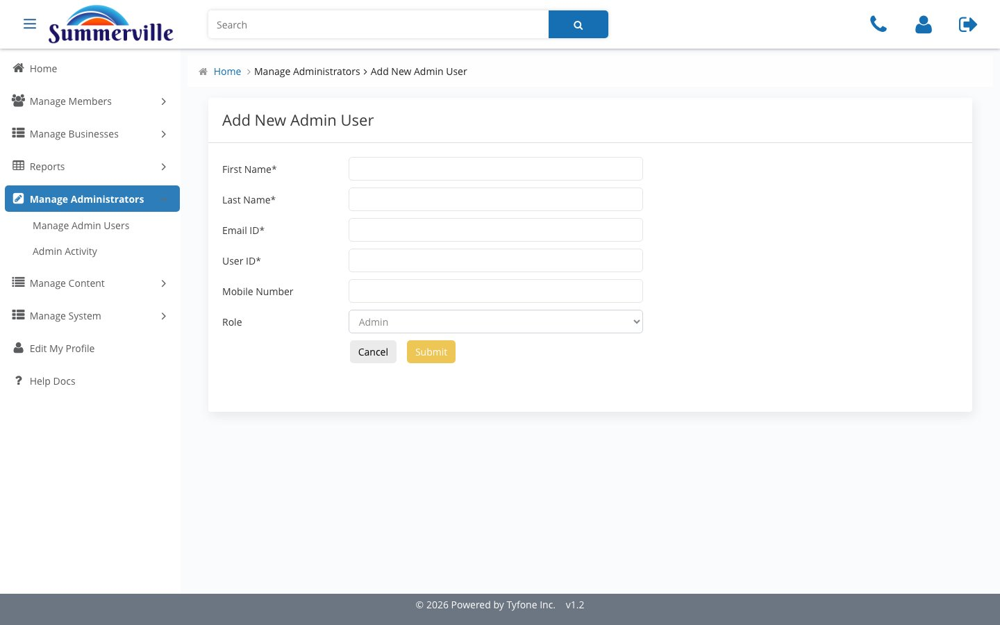
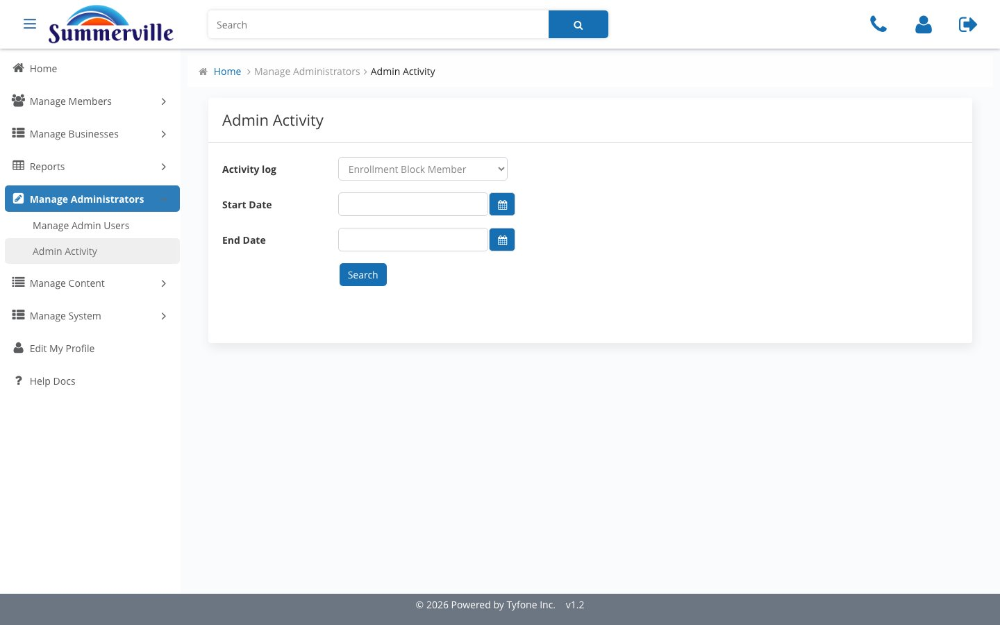
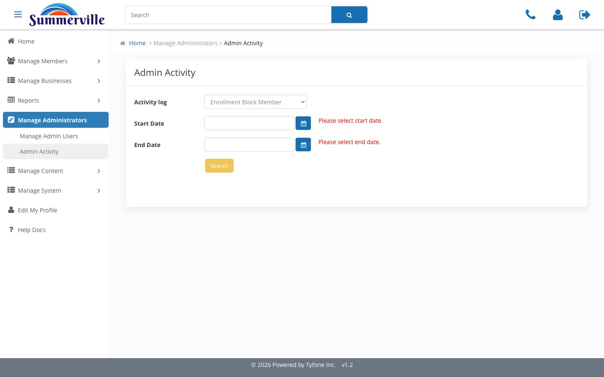

# Manage Administrators

_Summerville Admin Console › Manage Administrators_

## Manage Administrators

> Control who holds console access and maintain a full audit trail of every action they take.

### Step-by-Step Workflow

#### Step 1: Manage Admin Users

This is your roster of everyone with console access. Use the User ID radio button to look up a specific admin quickly — it's the fastest path when you have the ID from your access control sheet.

#### Step 2: Search by Name

Toggle the radio to Name and enter First and Last name when you only have HR's employee list. This is your fallback for quarterly recertification sweeps when User IDs aren't handy.

#### Step 3: Add New Admin User

Fill in Title, Description, Email, User ID, Mobile, and Role. The Role field is the access boundary — map it directly to the signed-off access matrix before saving, since this determines what the admin can touch across every module.

#### Step 4: Admin Activity

This is your audit log for every admin action taken in the console. Start Date and End Date are both mandatory, which enforces scoped extracts — no one can accidentally pull an unbounded dump of activity.

#### Step 5: Date fields required

Clicking Search without both dates returns "Please select start date / end date." This validation is intentional — it keeps audit exports reproducible and defensible during examiner reviews.

### Summary

Manage Administrators has two distinct surfaces: Manage Admin Users handles provisioning, and Admin Activity handles the audit trail. Keeping them separate reflects the different cadences at which access reviews and activity investigations happen — they serve different stakeholders and should be reviewed independently.

### Key Use Cases

* New Treasury hire needs console access: Add New Admin User, assign Role = Treasury-Ops, confirm against the access matrix.
* Quarterly access recertification: search by Name, reconcile the list against HR's active employee roster.
* Examiner requests an activity log for a specific window: Admin Activity with exact Start and End dates matching the exam period.
