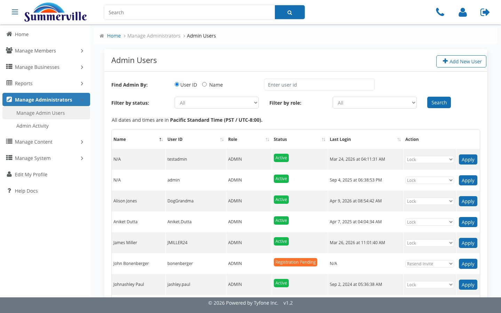
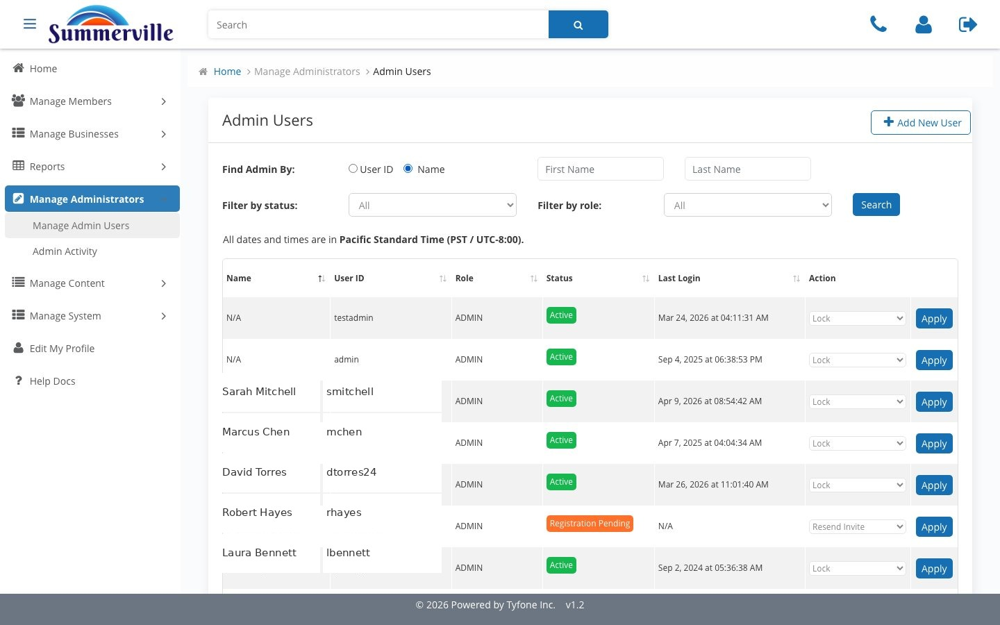

_Summerville Admin Console › Manage Administrators_

# Manage Administrators

> Who has console access, and what they've done with it.

## Step-by-Step Workflow

### Step 1: Manage Admin Users

Opens the roster. Default lookup is User ID radio + search.

### Step 2: Search by Name

Toggle the radio to Name. First and Last name fields replace User ID.

### Step 3: Add New Admin User

Capture Title, Description, Email, User ID, Mobile, and Role. Role is the access boundary.

### Step 4: Admin Activity

The audit log. Start Date and End Date are mandatory so every extract is scoped.

### Step 5: Date fields required

Clicking Search without dates returns Please select start date / end date.

## Summary

Two pages: Manage Admin Users for who has access, Admin Activity for what they did.

## Key Use Cases

- New Treasury hire: Add New Admin User, Role = Treasury-Ops.
- Quarterly recertification: search by Name, reconcile with HR's list.
- Examiner asks for a log: Admin Activity with the exam window.
