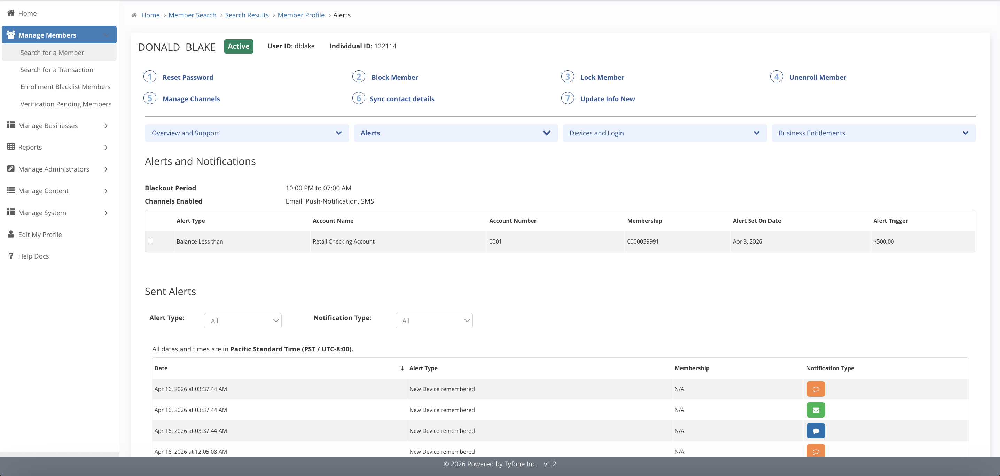
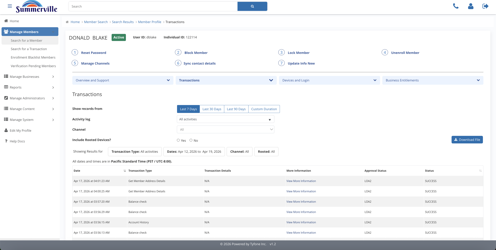
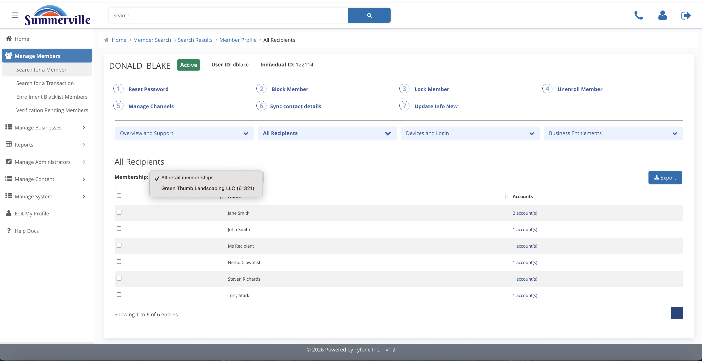
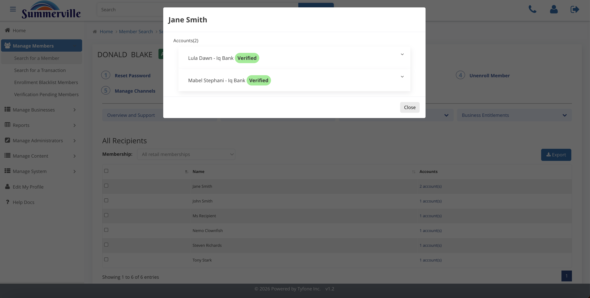

_Summerville Admin Console › Manage Members › Accounts & Activity_

# Manage Members: Accounts & Activity

> Everything about the member's money movement in one place.

## Step-by-Step Workflow

### Step 1: Accounts and Activity

Second blue pill on the profile. Opens six sub-panels: Accounts, Alerts, Transactions, Feature Enrollment, Scheduled Transfers, All Recipients.

### Step 2: Alerts

Shows blackout window, channels the member enabled, and every configured alert. Sent Alerts ledger underneath has per-channel delivery timestamps.

### Step 3: Transactions

Full activity with Last 7 / 30 / 90 Days chips and a Custom Duration picker. Rooted-device toggle filters to jailbroken sessions.

### Step 4: Activity log

Dropdown narrows the ledger to one action type: Balance check, Zelle Login, Bill Pay, etc.

### Step 5: All Recipients

Saved payees across every rail. Filter by Membership to scope to one business.

### Step 6: Recipient detail

Click a recipient to see every receiving account and its verified / unverified status.

## Summary

The financial surface-area view on the member profile. Built for dispute and fraud work: Transactions filter by date + activity type, Alerts shows delivery history per channel, All Recipients shows where money was going.

## Key Use Cases

- Bill-pay dispute: Transactions + Activity log = Bill Pay, export the row.
- "I never got alerted": Alerts > Sent Alerts ledger shows the delivery.
- Payment hasn't cleared: All Recipients > recipient detail shows verified status.
