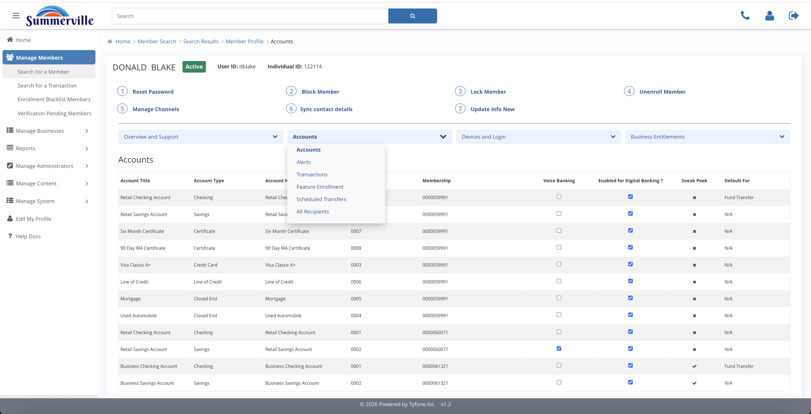
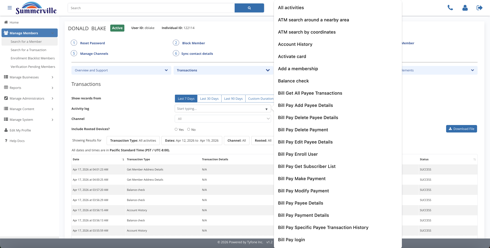

# Accounts & Activity

_Summerville Admin Console › Manage Members › Accounts & Activity_

## Manage Members: Accounts & Activity

> The financial activity view for a member — used for dispute investigation, fraud review, and alert-delivery diagnostics.

### Step-by-Step Workflow

#### Step 1: Accounts and Activity

This is the second blue pill tab on the member profile. It opens six sub-panels: Accounts, Alerts, Transactions, Feature Enrollment, Scheduled Transfers, and All Recipients — everything you need to reconstruct what a member has done financially.

#### Step 2: Alerts

Shows the member's configured alert preferences, which channels they've enabled, and the blackout window they've set. The Sent Alerts ledger below it gives you per-channel delivery timestamps — this is where you go first on any "I didn't get notified" dispute.

#### Step 3: Transactions

Full transaction history with Last 7 / 30 / 90 Days chips and a Custom Duration picker for precise date ranges. The rooted-device toggle filters the view to sessions originating from jailbroken devices, which is a useful first filter on fraud investigation calls.

#### Step 4: Activity log

The dropdown lets you narrow the ledger to a single action type — Balance check, Zelle Login, Bill Pay, and others. Use this when a member disputes a specific transaction type and you need to isolate exactly what happened without scrolling through unrelated activity.

#### Step 5: All Recipients

The complete list of saved payees across every payment rail — ACH, wire, Zelle. Filter by Membership to scope the view to a single business when the member manages more than one.

#### Step 6: Recipient detail

Click any recipient row to see every receiving account on file and its verified or unverified status. This is the check you run before escalating a payment dispute — unverified recipients are a common root cause of failed or delayed transactions.

### Summary

Accounts and Activity is the go-to section for dispute and fraud work. Transactions lets you filter by date range and activity type to isolate exactly what happened. Alerts tells you whether the member was notified and through which channel. All Recipients shows you where money was directed, with recipient-level verification status that often explains why a payment succeeded or failed.

### Key Use Cases

* Member disputes a bill payment: Transactions + Activity log filtered to Bill Pay, export the matching row for the dispute file.
* Member claims they were never alerted: Alerts panel, Sent Alerts ledger, read the per-channel delivery timestamp for that event.
* Payment to a new payee hasn't cleared: All Recipients, click the recipient, check whether the account is verified or still pending.
