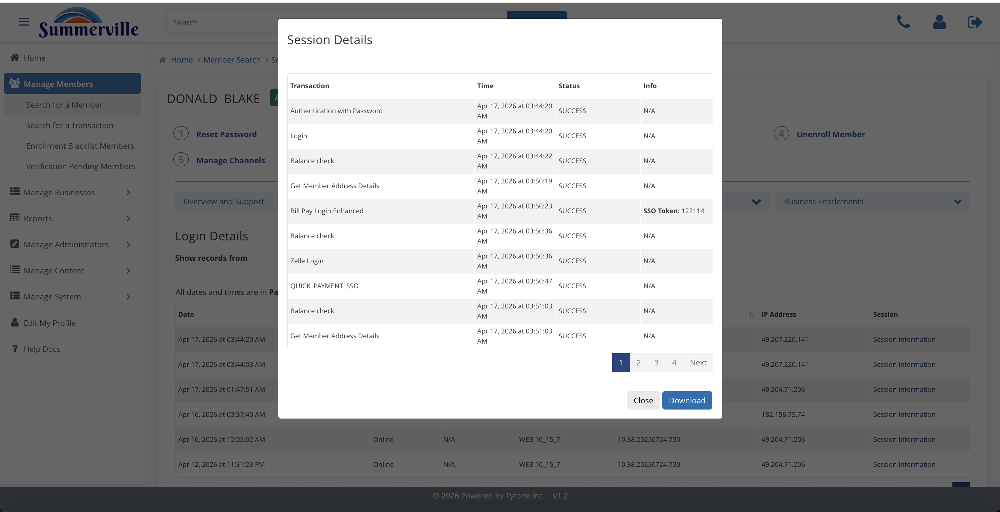

# Devices & Login

_Manage Members › Member Search › Search Results › Member Profile › Devices & Login_

## Manage Members: Devices & Login

> Devices & Login shows every device the member has authenticated from, every login event, and every session detail. Use it to investigate unauthorized access reports and to gather evidence on disputed transactions.

### Step-by-Step Workflow

#### Step 1: Access Devices

A grid of every browser and mobile device the member has authenticated from, with a Remembered flag indicating which are trusted. This is your starting point when a member reports unauthorized access — the device fingerprint tells you whether the session came from a known device or a new one.

#### Step 2: Device Information

Click View Information on any row to see the full device fingerprint: Device ID, Type, OS, version, and first-seen date. Copy the Device ID into your fraud case — it's the identifier that links this device to activity across all sessions.

#### Step 3: Login Details

A complete ledger of every successful login with IP address and user-agent. Use the date chips to scope the view to the dispute window, then click Session Information on the specific login you want to drill into.

#### Step 4: Session Details

Every transaction that occurred within a single login session — authentication, balance checks, Bill Pay, Zelle, and more. The Download button saves the full session as a structured file that serves as Reg-E compliant evidence for dispute resolution.

### Summary

Devices and Login is the forensic layer of the member profile. Access Devices gives you the device ledger with fingerprint detail, Login Details gives you the per-login record with IP and user-agent, and Session Details lets you download a complete session transcript as Reg-E evidence. For fraud investigations and unauthorized-access claims, this is where the case gets built.

### Key Use Cases

* Member reports account access they didn't initiate: Access Devices, click View Information on the unfamiliar device, copy the Device ID into the fraud case file.
* Reg-E dispute on a specific transaction: Login Details, scope to the dispute date, click Session Information, Download the session transcript as evidence.
