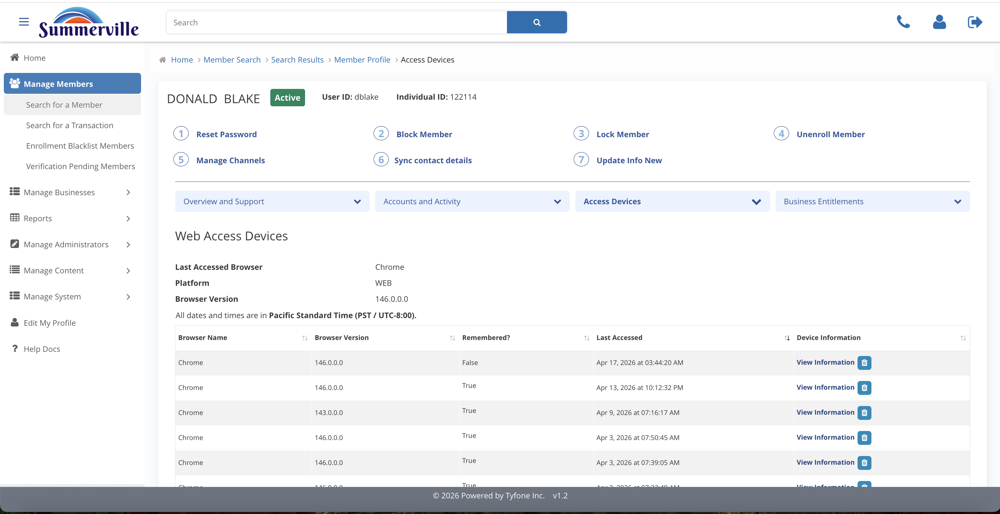
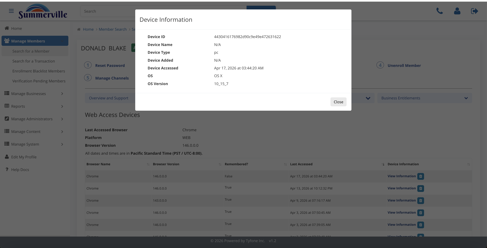
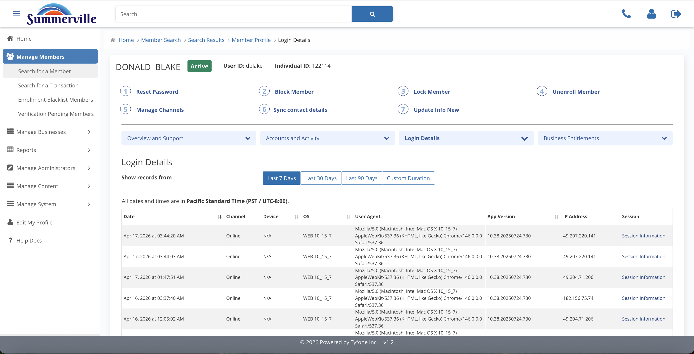

_Summerville Admin Console › Manage Members › Devices & Login_

# Manage Members: Devices & Login

> Forensic view: devices, logins, and per-session transaction logs.

## Step-by-Step Workflow

### Step 1: Access Devices

Grid of every browser and mobile device the member has signed in from. Remembered flag shows which are trusted.

### Step 2: Device Information

Click View Information on a row for the full fingerprint: Device ID, Type, OS, version, first-seen.

### Step 3: Login Details

Ledger of every successful login with IP and user-agent. Use the date chips to scope, then click Session Information.

### Step 4: Session Details

Every transaction inside one login: auth, balance check, Bill Pay, Zelle. Download saves the full session as Reg-E evidence.

## Summary

Forensic surface on the profile. Access Devices is the device ledger, Login Details is the login ledger, Session Details downloads a full session as evidence.

## Key Use Cases

- Session-hijack claim: Access Devices > View Information > copy Device ID into fraud case.
- Reg-E dispute: Login Details > Session Information > Download.
