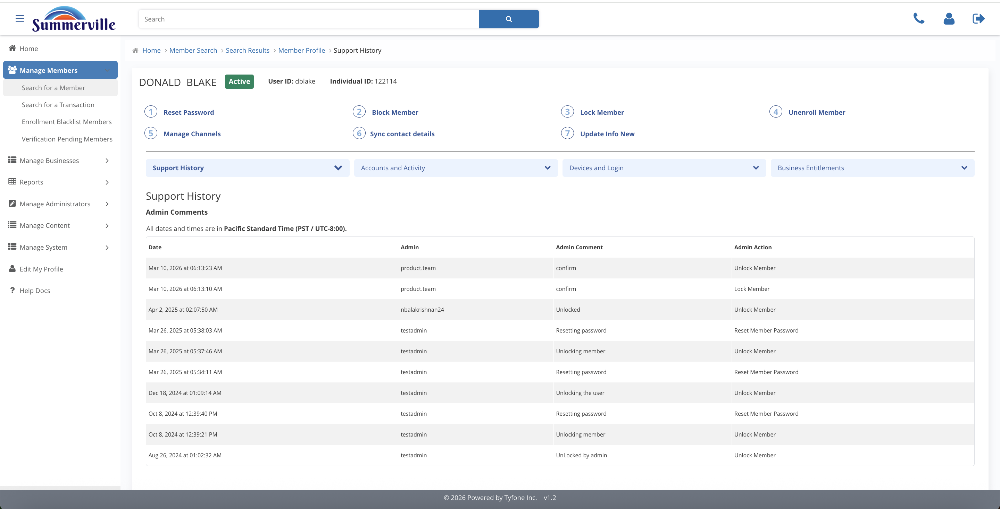

# Overview & Support

_Manage Members › Member Search › Search Results › Member Profile › Member Information_

## Manage Members: Overview & Support

> Overview & Support is the first screen you see when you open a member profile. The left side has identity facts; the right side has the full action history.

### Step-by-Step Workflow

#### Step 1: Overview and Support

This is the first blue pill tab under Profile Actions. It surfaces Member Information (the identity record) and Support History (the chronological log of every admin action ever taken on this account) in a single view.

#### Step 2: Support History

Every reset, lock, block, unenroll, and channel change appears here in order, with the Admin Comment and the staff member who performed it. Check this before touching anything on a second-touch call — it tells you exactly what was already done and why.

### Summary

Overview and Support is the default landing section when you open any member profile. Member Information gives you the identity snapshot, and Support History gives you the complete chronological audit of every admin action on the account. For multi-touch support cases, this is the section that prevents duplicate actions and conflicting interventions across staff members.

### Key Use Cases

* Second CSR picks up a callback: Support History immediately shows what the first CSR did and what comment they left, preventing a repeat reset or conflicting action.
* Compliance control review: Support History entries map directly to change tickets, giving reviewers a traceable record of every intervention.
