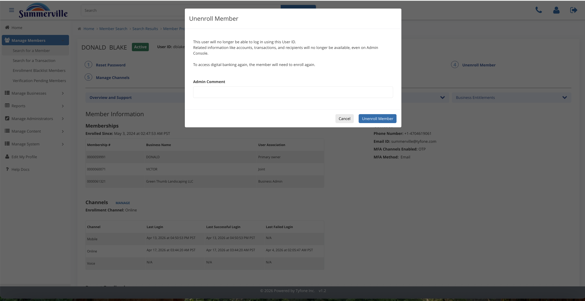
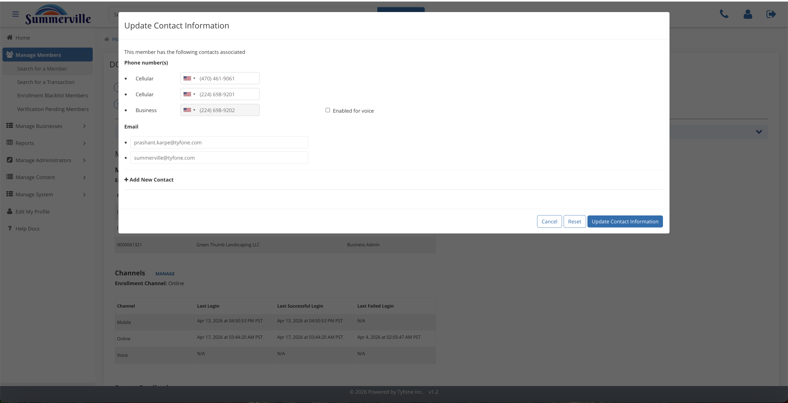

# Profile Actions

_Manage Members › Member Search › Search Results › Member Profile › Member Information_

## Manage Members: Profile Actions

> Profile Actions are the seven safeguard actions at the top of every member profile. Each one opens a modal and writes to the audit trail.

### Step-by-Step Workflow

#### Step 1: Member Profile

Before clicking anything, confirm the name, status pill (Active / Locked / Blocked), and Individual ID match what the member or case ticket describes. Acting on the wrong profile is the most preventable support error there is.

#### Step 2: Reset Password

Choose from Email link, SMS temp password, or Generate Temporary Password based on what contact information is verified and on file. Always enter a ticket number, reason, and any other details in **Admin Comment** — this ties the reset to the service request and shows up in Support History for the next staff member who touches this account.

#### Step 3: Block Member

Block stops the member from transacting while preserving their enrollment and account history. Admin Comment is required — document the reason clearly, because this entry is what compliance and operations will read during any subsequent review.

#### Step 4: Lock Member

Lock is the fast login freeze for active fraud calls — it cuts off access immediately without removing the enrollment. It's reversible from Manage Members > Locked Members once the situation is resolved.

#### Step 5: Unenroll Member

Unenroll removes the digital profile entirely and is the correct action at account closure. This is not reversible — the member would need to re-enroll from scratch, so confirm account closure status in the core before proceeding.

#### Step 6: Manage Channels

Toggle Online, Mobile, and Voice channels individually. The current state is pre-ticked, so you're unticking what you want to disable — useful when a member needs to be restricted to one channel without a full block.

#### Step 7: Sync Contact Details

Pulls fresh phone and email data from the core system when a branch update hasn't flowed through to the digital platform yet. Use this before attempting any OTP-based reset if the member says they're not receiving codes.

#### Step 8: Update Info New

Displays a side-by-side comparison of Bank Core vs nFinia contact records. Tick only the specific rows you want to push to digital — this gives you field-level control rather than a blanket overwrite.

### Summary

Each of the seven profile action buttons opens a modal that requires an Admin Comment before committing — this is by design, ensuring every action is documented in Support History. Reset covers login recovery, Block and Lock handle fraud and compliance scenarios, Unenroll is for account closure, Manage Channels controls access at the channel level, and Sync and Update Info New resolve contact data gaps between the core and the digital platform.

### Key Use Cases

* Business owner locked out before payroll runs: Reset Password using Generate Temporary Password, note the ticket ID in Admin Comment.
* Fraud alert on a wire transaction: Lock Member immediately, paste the alert reference ID into Admin Comment for the audit trail.
* Branch updated a member's phone number but OTPs still failing: Sync Contact Details to pull the fresh core record into digital.
