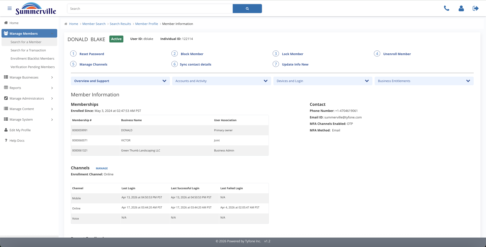
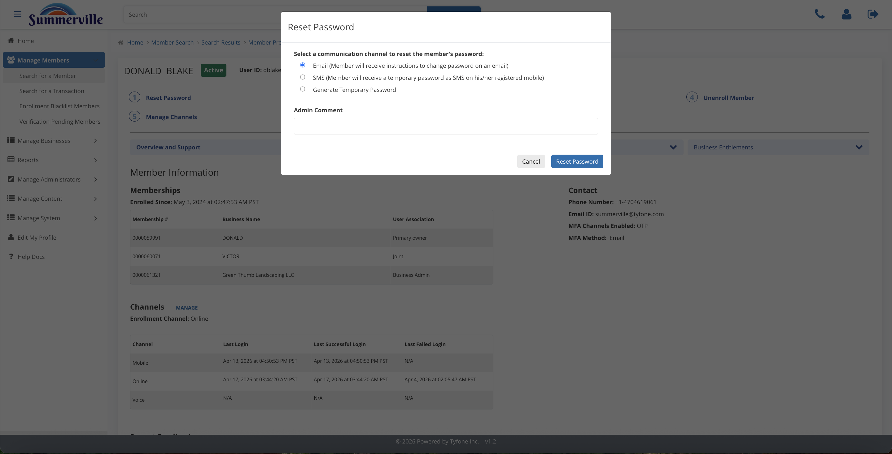
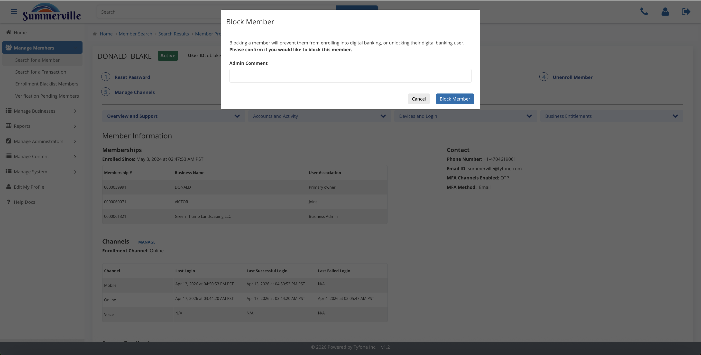
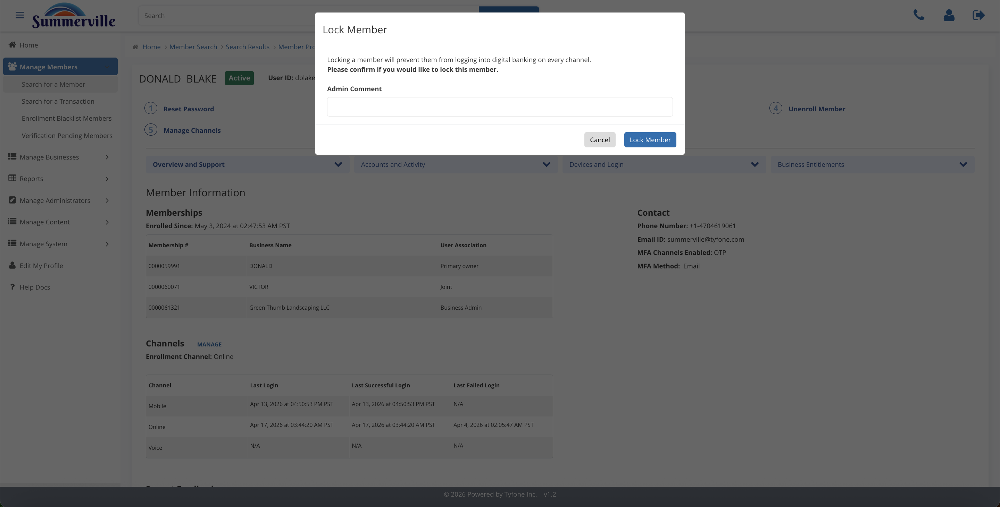
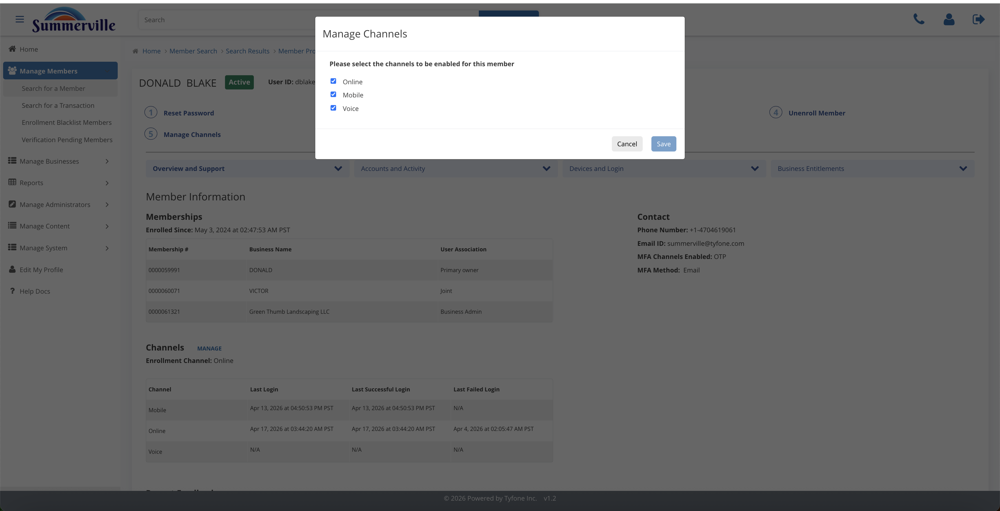
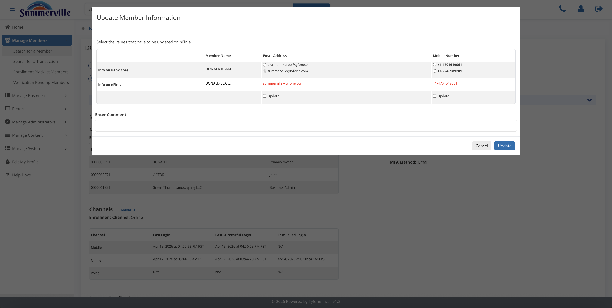

_Summerville Admin Console › Manage Members › Profile Actions_

# Manage Members: Profile Actions

> The seven safeguard buttons at the top of a member profile.

## Step-by-Step Workflow

### Step 1: Member Profile

Check the name, status pill (Active / Locked / Blocked), and Individual ID before you click anything.

### Step 2: Reset Password

Pick Email link, SMS temp password, or Generate Temporary Password. Add a ticket number in Admin Comment, then Reset.

### Step 3: Block Member

Stops the member from transacting but keeps their enrollment. Admin Comment is required.

### Step 4: Lock Member

Fast login freeze during a fraud call. Reversible from Manage Members > Locked Members.

### Step 5: Unenroll Member

Removes the digital profile completely. Use at account closure.

### Step 6: Manage Channels

Toggle Online / Mobile / Voice. Current state is pre-ticked; untick what you want to disable.

### Step 7: Sync Contact Details

Pulls fresh phone/email from the core when branch updates haven't flowed to digital.

### Step 8: Update Info New

Side-by-side Bank Core vs nFinia compare. Tick only the rows you want to push.

## Summary

Seven buttons at the top of every member profile. Each opens a modal and captures an Admin Comment. Reset is for login recovery, Block and Lock are safeguards, Unenroll is for closure, Manage Channels toggles access, Sync and Update Info New fix stale contact data.

## Key Use Cases

- Business owner locked out before payroll: Reset Password with Generate Temporary.
- Fraud alert on a wire: Lock Member with the alert ID in Admin Comment.
- Branch updated phone/email, digital still stale: Sync Contact Details or Update Info New.
