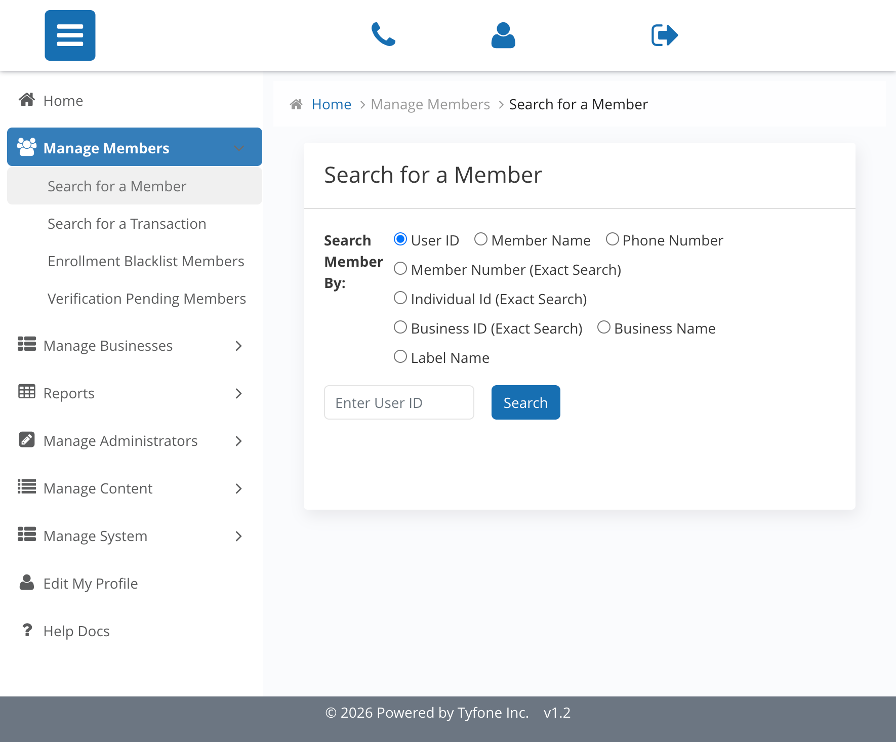

# Search

_Summerville Admin Console › Manage Members › Search & Lookup_

## Manage Members: Search & Lookup

> Every member-level action starts here — you cannot act on a member without finding them first.

### Step-by-Step Workflow

#### Step 1: Search for a Member

Navigate to Manage Members and select Search for a Member. User ID is the default filter and the fastest path — use it whenever the member or a colleague can supply it directly.

#### Step 2: No entries found

If no results come back on User ID, switch the radio to Member Name and enter first and last name. This is the standard fallback for walk-in support calls where the member doesn't remember their login credentials.

### Summary

Search is the mandatory entry point for every admin action in Manage Members. Every downstream operation — password reset, lock, block, unenroll — is gated behind finding the member first, which prevents accidental actions on the wrong account. User ID is the fastest lookup; Member Name is the fallback when the member can't provide it.

### Key Use Cases

* Member calls in with their User ID: search by User ID, land on profile in one click.
* Walk-in member doesn't know their ID: search by first and last name, verify identity before proceeding.
