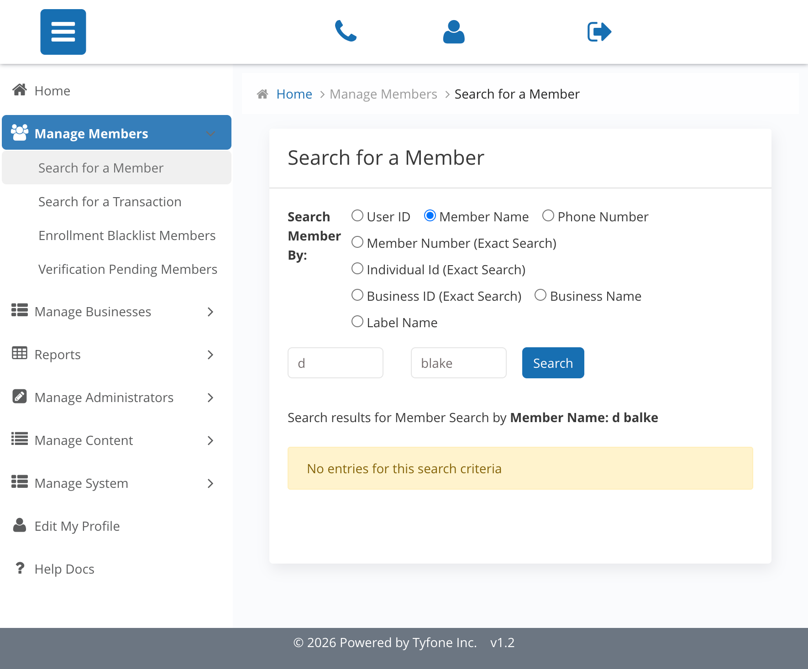

_Summerville Admin Console  ›  Manage Members  ›  Search & Lookup_

# Manage Members — Search & Lookup

> Locate a member in the Summerville Admin Console by User ID or Name before running any safeguard or servicing action.

## Summary

Search & Lookup is the single entry point to the Manage Members module. Every sensitive action — Reset Password, Lock, Unenroll, entitlement review — is scoped to a specific verified member, which is why the search surface is deliberately narrow and does not mix retail with pre-enrolled records.

The default filter is User ID because that is the fastest lookup for an authenticated support call; eight additional filters are available for calls where the member cannot remember their login. A dry well surfaces a soft No entries notice so the operator can retry without losing the page, and switching the radio to Member Name exposes a first-and-last name pair for fuzzy lookup.

## Key Use Cases

A business owner calls about an authentication problem and reads their User ID from memory. The CSR opens Search for a Member, keys the ID, and is routed straight to the profile in one click — this is why the default filter is User ID.

A member calls who does not remember their digital login but can give their name and the business they administer. The operator switches the radio to Member Name, splits first and last, and scans the results for the right Individual ID before clicking through.

## End-to-End Workflow

### Prerequisites

- Admin login with Manage Members access; the member must be a verified enrollment (pre-enrolled identities live under Pre-Enrolled Block rather than Manage Members).
- Ticket number, call reference, or alert ID to capture in the Admin Comment on every sensitive action — a blank comment is treated as a control failure.
- For dispute or fraud investigations: the disputed transaction date and time window agreed with the member so Transactions and Session Details can be scoped precisely.
- For business-member entitlement review: the specific business the signer administers, so the Business Permissions and Business Limits panels can be loaded against the correct entity.

### Step-by-Step Flow

#### Step 1 — Open the Search for a Member page

Pick Manage Members > Search for a Member from the left sidebar. The default filter is User ID because that is the fastest lookup for an authenticated support call; eight additional filters are available for calls where the member cannot remember their login.

#### Step 2 — Fall back to a softer filter if no match

If the member gives a name instead of a user ID, switch the radio to Member Name and split first and last. A dry well surfaces an inline No entries notice rather than an error, so the operator can retry without losing the page.

