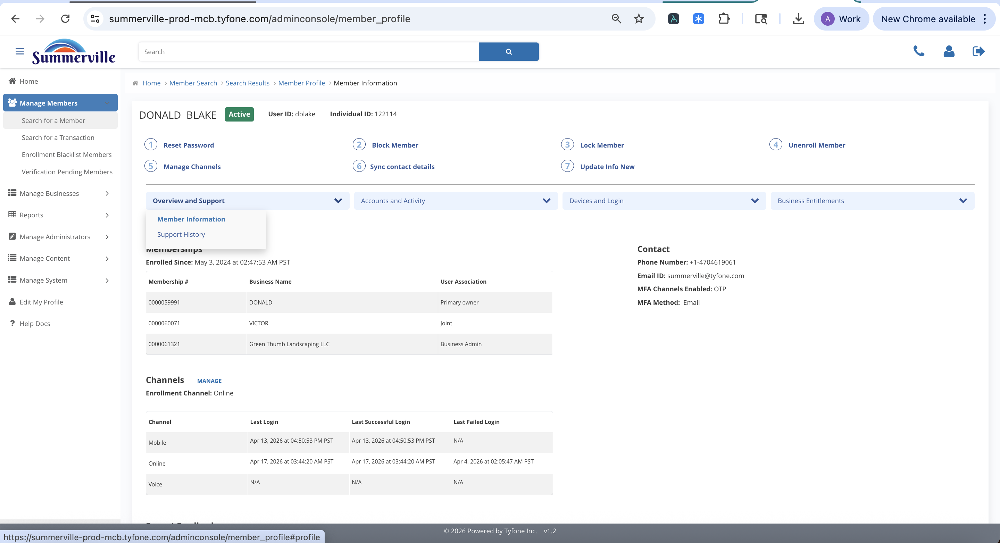

_Summerville Admin Console  ›  Manage Members  ›  Overview & Support_

# Manage Members — Overview & Support

> Read the Member Information panel and the Support History audit trail that records every admin action taken against a member.

## Summary

Overview & Support is the first pill under the Profile Actions row and the panel the profile lands on by default. It exposes two surfaces: Member Information, which captures identity facts, and Support History, which is the chronological record of every admin action taken against the member — password resets, locks, unlocks, blocks, unenrollments, and who performed each.

Support History is the first thing to check on a second-touch call; it often tells the operator what a colleague tried thirty minutes ago and prevents the most common operational error, which is repeating an action that was already performed. It is also the single control evidence a risk or audit review will ask for when reconstructing an incident.

## Key Use Cases

A member calls back ninety minutes after an earlier support interaction saying the problem is not fixed. The second CSR opens Support History, sees the Reset Password action taken by the first CSR and its Admin Comment, and avoids repeating the reset — which would have locked the member out of the one-time password they already received.

During a quarterly control review the ISO reconciles Support History entries against HR's change-management tickets and the Manage Administrators roster to confirm every admin action on a sample of members was authorised.

## End-to-End Workflow

### Prerequisites

- Admin login with Manage Members access; the member must be a verified enrollment (pre-enrolled identities live under Pre-Enrolled Block rather than Manage Members).
- Ticket number, call reference, or alert ID to capture in the Admin Comment on every sensitive action — a blank comment is treated as a control failure.
- For dispute or fraud investigations: the disputed transaction date and time window agreed with the member so Transactions and Session Details can be scoped precisely.
- For business-member entitlement review: the specific business the signer administers, so the Business Permissions and Business Limits panels can be loaded against the correct entity.

### Step-by-Step Flow

#### Step 1 — Expand the Overview and Support dropdown

The first pill under the quick actions is Overview and Support, and it is where the profile lands. Inside it exposes Member Information (the default) and Support History, which together carry the identity and audit-trail views the operator needs first.

#### Step 2 — Read the admin audit trail on Support History

Support History is the chronological record of every admin action taken against this member — password resets, locks, unlocks, blocks, and who did them. Use it as the first thing to check on a second-touch call; it often tells the operator what a colleague tried thirty minutes ago.

