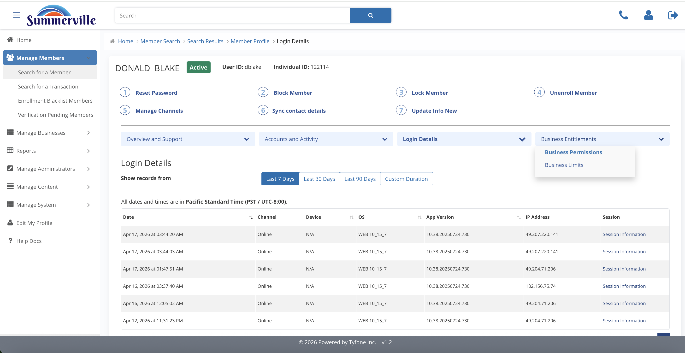

_Summerville Admin Console  ›  Manage Members  ›  Business Entitlements_

# Manage Members — Business Entitlements

> For commercial signers: what they can do, and what their caps are.

## Step-by-Step Workflow

### Step 1 — Business Entitlements

Fourth blue pill on the profile. Opens Business Permissions and Business Limits, keyed by the Select business dropdown.

### Step 2 — Business Permissions

Pick a business. Each leaf in the tree is a capability (View Transfer, Access Bill Pay, etc.). Search bar jumps to a specific one.

### Step 3 — Business Limits

Count and dollar caps per flow — ACH collection, payroll template, wire. Shows whether the cap is per-transaction, daily, or monthly.

## Summary

Commercial-only section on the member profile. Two panels per business the member administers — Permissions (what they can do) and Limits (how much they can move).

## Key Use Cases

- Audit check → Permissions, search the tree for the specific authorisation.
- Declined payroll → Limits, read Max Per Transaction / Daily / Monthly.
