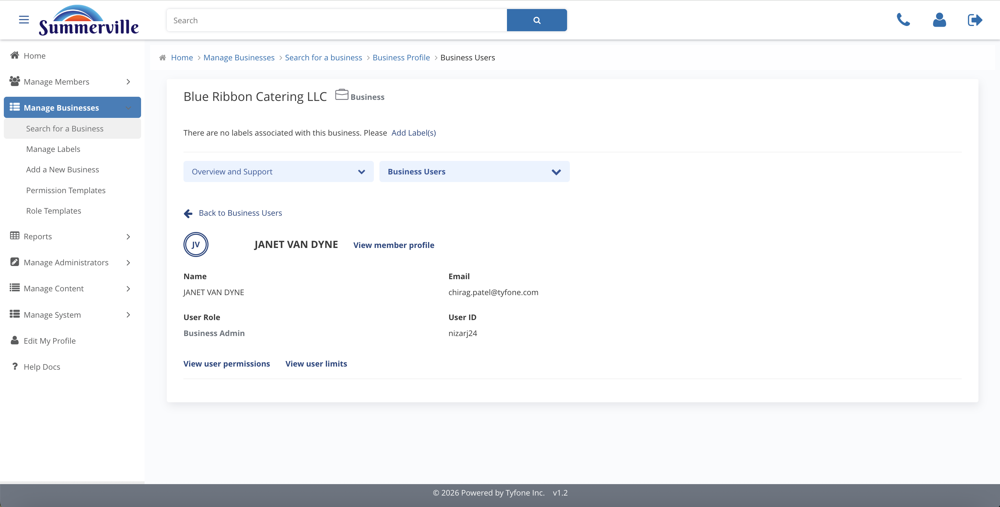
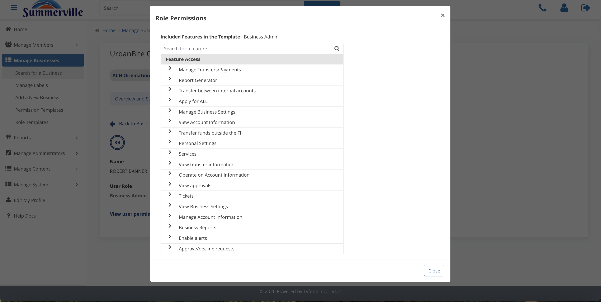
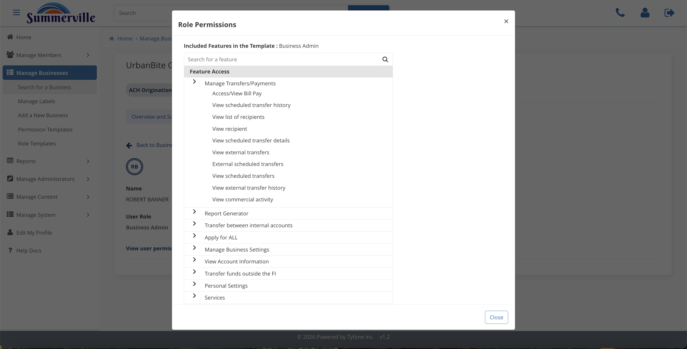
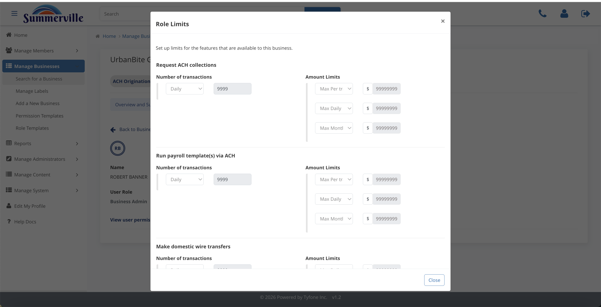

_Summerville Admin Console › Manage Business › Business Users_

# Manage Business: Business Users

> The diagnostic surface for commercial access issues — applied permissions and dollar limits for each employee, visible in two clicks.

## Step-by-Step Workflow

### Step 1: Business User Detail

Every employee enrolled in this business's digital banking appears here with their assigned role. Click any user to see the entitlements they've inherited — this is your starting point for any "user can't do X" support ticket.

### Step 2: Role Permissions

The permissions modal shows every feature flag the user's role carries: Bill Pay, Scheduled Transfers, Recipients, Wires, ACH, and the full Manage Transfers and Payments hierarchy. This tells you definitively whether the capability the user is trying to access has been granted to their role.

### Step 3: Role Permissions (expanded)

The full expanded hierarchy beneath Manage Transfers and Payments — the same feature tree the end user sees on their dashboard. Use this to pinpoint exactly which sub-permission is missing when a user can see a feature but can't complete a specific action within it.

### Step 4: Role Limits

Dollar ceilings per payment flow for this user's role: ACH collections, payroll template, domestic wire. Compare these against the Business Limits to identify whether the binding constraint is at the role level or the entity level — that distinction determines whether the fix needs to happen in User Roles or Business Limits.

## Summary

Business Users is the diagnostic surface for commercial support tickets. The Permissions modal shows the complete feature tree, and the Limits modal shows the dollar caps — together they answer the question of what a specific user can and can't do and why. Most commercial access issues are visible here without needing to escalate to operations or make any changes.

## Key Use Cases

- Controller reports they can't release wire transfers: open Role Permissions, expand Manage Transfers and Payments, look for the wire-release leaf and confirm whether it's enabled.
- Business payment was rejected: compare the attempted amount against Role Limits and Business Limits to identify whether the binding cap is at the role level or the entity level.
