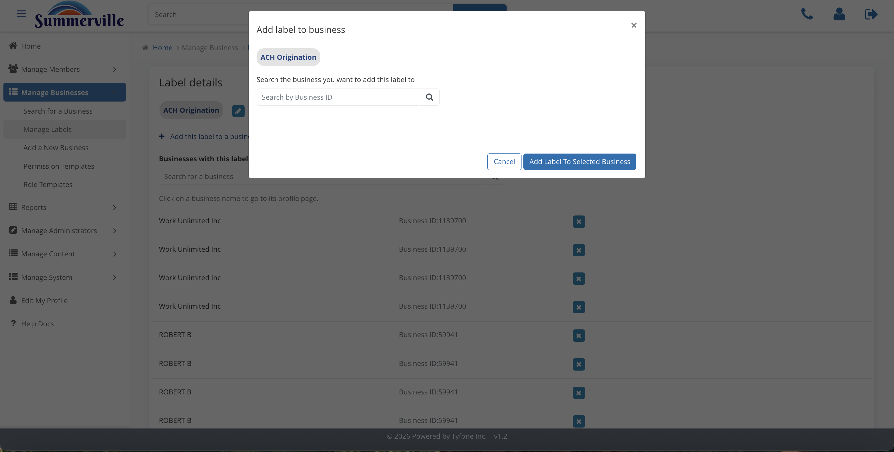

# Business Labels

_Manage Business › Business Labels_

## Manage Business: Business Labels

> Business Labels are the segmentation tags that drive campaigns, risk sweeps, and pricing reviews. Maintain the catalogue carefully — labels feed every downstream report and journey.

### Step-by-Step Workflow

#### Step 1: Manage Labels

The full catalogue of labels in use: ACH Origination, LLC business, Platinum, Privileged, demo, and any others provisioned for Summerville. Treat this like a CRM tag taxonomy — every label here should have a clear owner and a documented purpose, because they drive downstream reports and journeys.

#### Step 2: Label Details

Open any label to see every business currently tagged with it, each one link-clickable directly into its profile. This is how you fan out from a segment to a member list — faster than running a report and more actionable because each result is immediately accessible.

#### Step 3: Remove Label

A confirmation modal appears before any label is removed. Remember that removing a label from the catalogue affects every business tagged with it and any downstream campaign or journey that targets that segment — pause those journeys before proceeding.

#### Step 4: Add Label

From a Business Profile, attach one or more catalogue labels to that specific entity. The label takes effect immediately and is picked up by any report or journey that filters on it — so confirm the correct label before saving.

### Summary

Labels are the segmentation backbone for business banking operations at Summerville. Campaigns, reports, and automated journeys all pivot on label membership, which makes the catalogue in Manage Labels a critical piece of operational infrastructure — not just metadata. New labels should be provisioned deliberately, and removal should always be preceded by an impact check on active campaigns and journeys.

### Key Use Cases

* Treasury wants a list of ACH originating businesses for a positive-pay campaign: open the ACH Origination label in Manage Labels, hand the linked member list directly to Treasury.
* Business client is promoted to Privileged service tier: go to Business Profile, Add Label, select Privileged — the client is immediately included in any Privileged-targeted journeys and reports.
