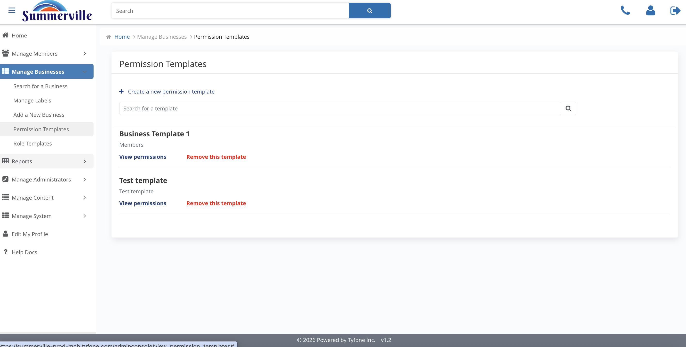
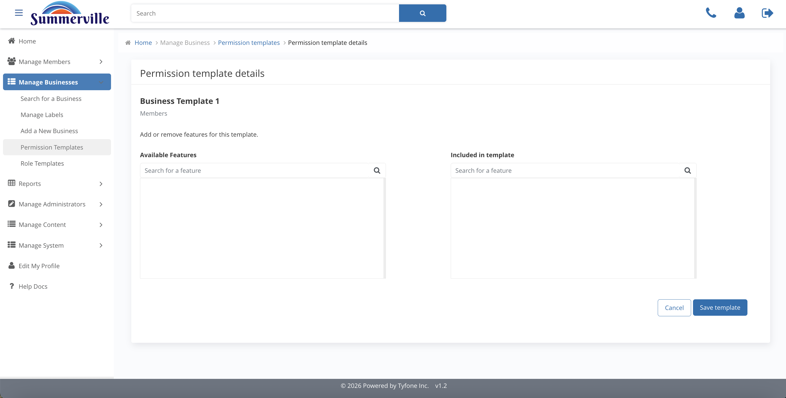
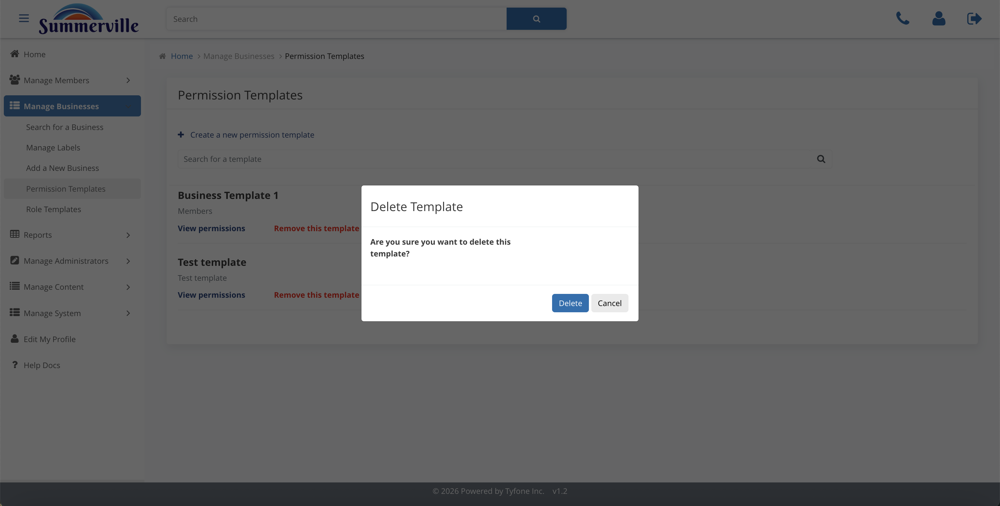

# Onboarding & Permission Templates

_Summerville Admin Console › Manage Business › Onboarding_

## Manage Business: Onboarding & Permission Templates

> Bring a new business into digital banking by exact Business ID, and maintain the entitlement bundles that every new business inherits from day one.

### Step-by-Step Workflow

#### Step 1: Add a New Business

Enter the exact Business ID to pull the core legal-entity record into the digital banking platform. The Matching Results screen flags any duplicates before they're created — a duplicate record splits the audit trail across two entities, which creates serious problems for compliance and operations down the line.

#### Step 2: Permission Templates

The central catalogue of entitlement bundles available to assign during onboarding: Business Template 1, Test Template, and any approved additions. Every new business inherits one of these templates as its starting point — this is how the credit union standardizes its commercial service tiers across all clients.

#### Step 3: Permission Template Details

The full list of capabilities included in a given template: Bill Pay, Scheduled Transfers, Recipients, external transfers, and more. Review this before assigning to a new client to confirm it matches their approved service agreement.

#### Step 4: Edit Permission Template

Dual-pane Available / Included editor that applies credit-union-wide. Any change to a Permission Template propagates into every future onboarding that uses it — treat every edit as a policy change, document it, and confirm it's been approved before saving.

#### Step 5: Delete Template

A confirmation modal appears before any template is deleted. This is effectively a policy retirement — confirm a replacement template is in place and any in-progress onboardings are accounted for before deleting.

### Summary

Onboarding maps a Business ID to the core record and assigns a Permission Template as the entitlement baseline. Permission Templates are the bank-wide standard service tiers — editing one changes the starting point for every future onboarding that references it, which means template edits carry the same weight as a policy change and should be treated accordingly.

### Key Use Cases

* New commercial loan closes and needs digital banking access: enter the Business ID, confirm no duplicate match, assign Business Template 1, client is live with standard entitlements on day one.
* Credit union launches a new treasury feature for all commercial clients: edit Business Template 1 to include the feature — every future onboarding inherits it automatically without individual configuration.
