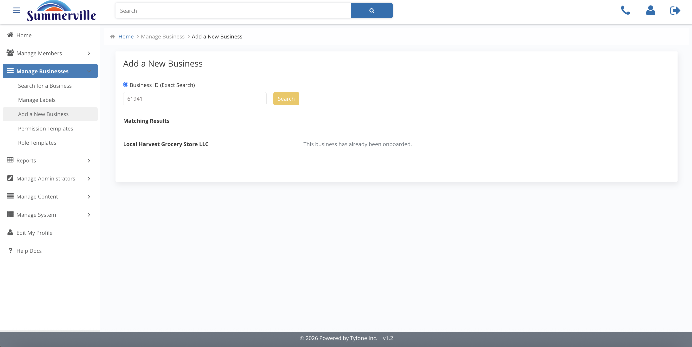
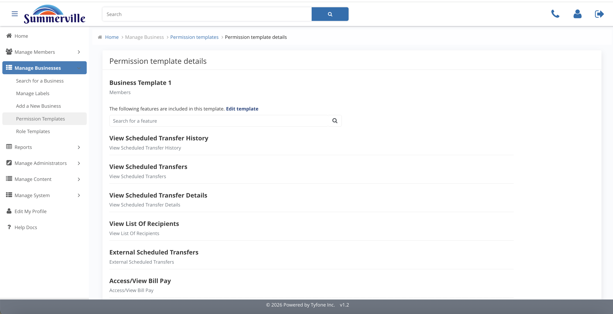

_Summerville Admin Console › Manage Business › Onboarding_

# Manage Business: Onboarding & Permission Templates

> Onboard a business by exact Business ID and maintain the central entitlement bundles every new business inherits.

## Step-by-Step Workflow

### Step 1: Add a New Business

Exact Business ID lookup. On match, the core legal-entity record is pulled into digital banking. Matching Results flags duplicates.

### Step 2: Permission Templates

Central catalogue of entitlement bundles: Business Template 1, Test Template, and approved additions. Every new business inherits one.

### Step 3: Permission Template Details

Every feature in the bundle: Bill Pay, Scheduled Transfers, Recipients, external transfers.

### Step 4: Edit Permission Template

Dual-pane Available / Included editor, credit-union-wide. Changes ripple into every future onboarding that picks this template.

### Step 5: Delete Template

Confirmation modal. Document the change and line up a replacement first.

## Summary

Onboarding is Business ID > core pull > template assignment. Permission Templates are the bank-wide bundles; editing one changes every future onboarding.

## Key Use Cases

- New commercial loan onboards: key Business ID, assign Business Template 1, live on day one.
- New treasury feature launched: edit Business Template 1 to include it; every future client inherits.
