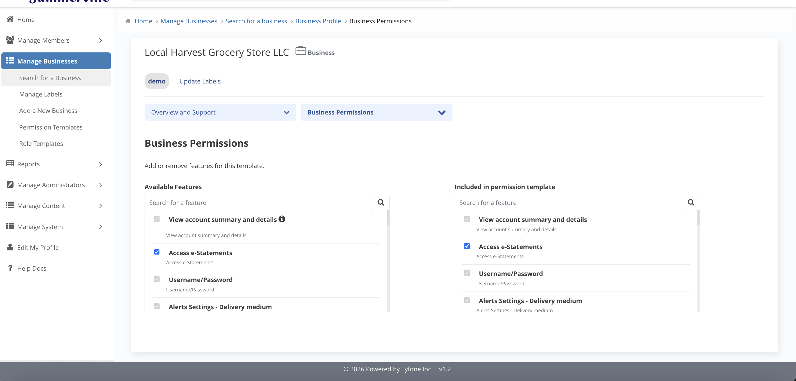

# Permissions & Limits

_Summerville Admin Console › Manage Business › Permissions & Limits_

## Manage Business: Permissions & Limits

> The entity-level capability and dollar ceiling — every user in the business inherits both.

### Step-by-Step Workflow

#### Step 1: Business Permissions

The live feature catalogue for this business entity — shows exactly which payment and account capabilities are currently active: ACH, wires, bill pay, scheduled transfers, recipients, and more. This is your read-only confirmation before making any change.

#### Step 2: Edit Business Permissions

Two-pane editor: Available on the left, Included on the right. Move features across to match the signed pricing schedule and the BSA/AML approved service agreement — saves propagate to all users on the business at their next login.

#### Step 3: Business Limits

The entity-level dollar ceiling across all payment flows. No individual user role in this business can exceed these limits regardless of what their role allows — it's the hard ceiling for the entire relationship.

#### Step 4: Edit Business Limits

Three inputs per payment feature: Max Per Transaction, Max Daily, and Max Monthly. Set these against the credit memo and BSA/AML risk profile for the business — these numbers have direct compliance implications and should be documented as part of the onboarding or change approval.

### Summary

Permissions and Limits are the two entity-level controls that govern everything every user in the business can do. Permissions defines the capability set — what payment features the business has access to at all. Limits defines the dollar ceilings on each — the binding constraints that no user role can override. Changes to either should always trace back to a signed agreement or credit memo.

### Key Use Cases

* Business client expands to international suppliers and needs wires: add Wire Transfer in Edit Business Permissions, raise the wire Max Per Transaction and Daily in Edit Business Limits to match the credit memo.
* ACH-only onboarding: leave Wires on the Available side until dual-control is documented and in place.
