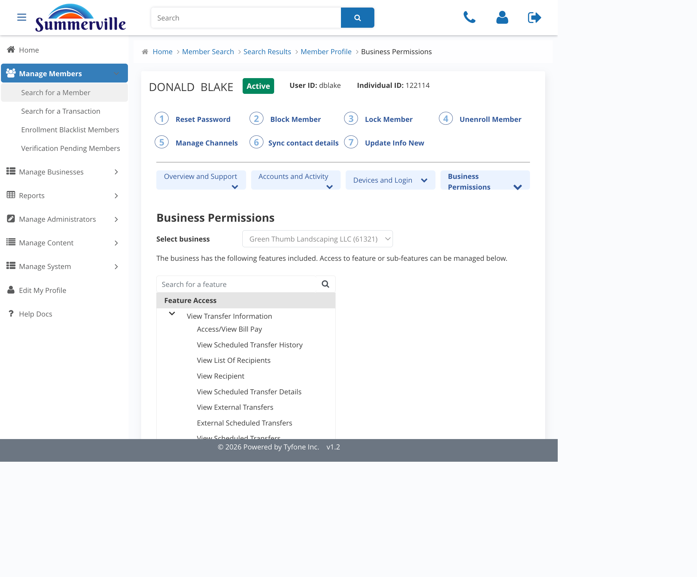
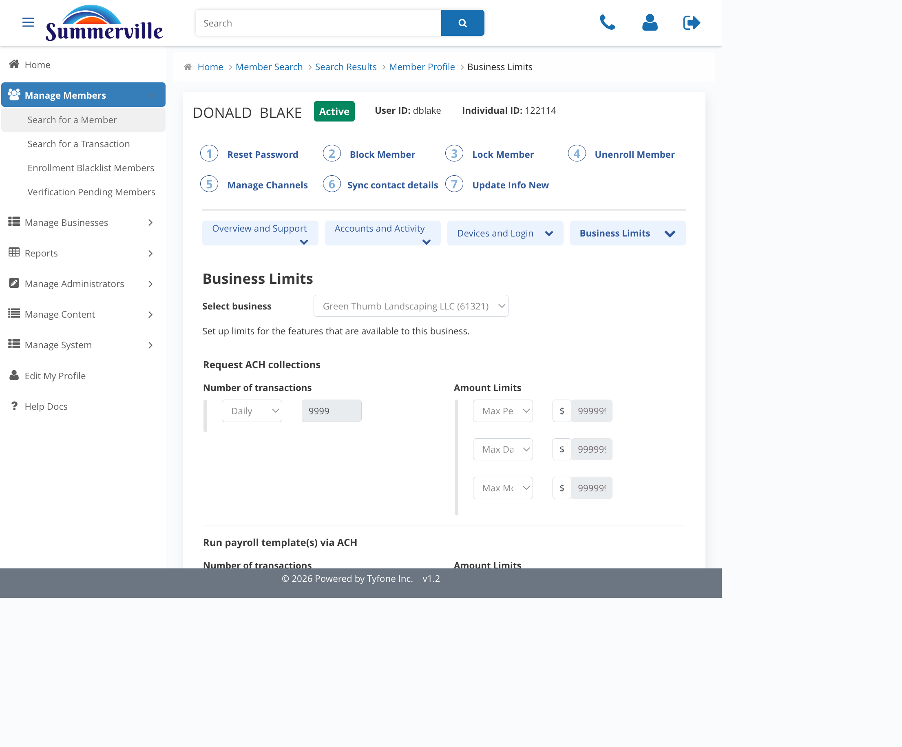

# Business Permissions & Limits

_Manage Business › Business Search › Search Results › Business Profile › Business Permissions & Limits_

## Manage Business: Business Permissions & Limits

> Business Permissions sets the features the business can use, and Business Limits sets the dollar ceilings on each. Every user in the business inherits both.

### Step-by-Step Workflow

#### Step 1: Business Permissions

The live feature catalogue for this business — shows which payment and account capabilities are currently active: ACH, wires, bill pay, scheduled transfers, recipients, and more. Read this view first to confirm the current state before any change.

#### Step 2: Edit Business Permissions

Once **Edit Permission** is clicked, the two-pane editor opens. The left pane shows all the available features for the business; the right pane is for the admin staff to choose which features can be picked in a permission template under Role Management.

#### Step 3: Business Limits

The dollar ceiling for the business across all payment flows. No user role in this business can exceed these limits — it's the hard cap for the entire business.

#### Step 4: Edit Business Limits

The staff can set up the ceiling limit for each of the payment types.

#### Step 5: Business Permissions via Member Profile (Alternative Path)

The same controls are reachable from a member's profile. Open the **Business Entitlements** tab on the profile and use the **Select business** dropdown to scope to the right business — members who administer multiple businesses have a separate permissions and limits set for each one.

#### Step 6: Business Permissions Tree from the Profile

Each leaf node is a specific capability — View Transfer, Access Bill Pay, Initiate ACH, and so on. The search bar lets you jump directly to a specific permission when you're diagnosing why a user can or can't perform a particular action.

#### Step 7: Business Limits from the Profile

The per-payment-flow caps the member sees through the business — per-transaction, daily, and monthly, broken out by ACH collection, payroll template, wire, and so on. Compare these against the business-level limits to identify which cap is binding when a payment gets declined.

### Summary

Permissions and Limits are the two controls that govern what every user in the business can do. Permissions defines the capability set — the payment features the business has access to. Limits defines the dollar ceilings on each. The same controls can be reached either from the Business Profile (Manage Business) or from a member's profile via Business Entitlements; both paths edit the same underlying values.

### Key Use Cases

* Business client expands to international suppliers and needs wires: add Wire Transfer in **Edit Business Permissions**, raise the wire Max Per Transaction and Daily values in **Edit Business Limits** to match the agreed amounts.
* Quick fix from a support ticket on a single user's profile: open the member, switch to **Business Entitlements**, pick the business, and adjust limits inline without leaving the profile.
