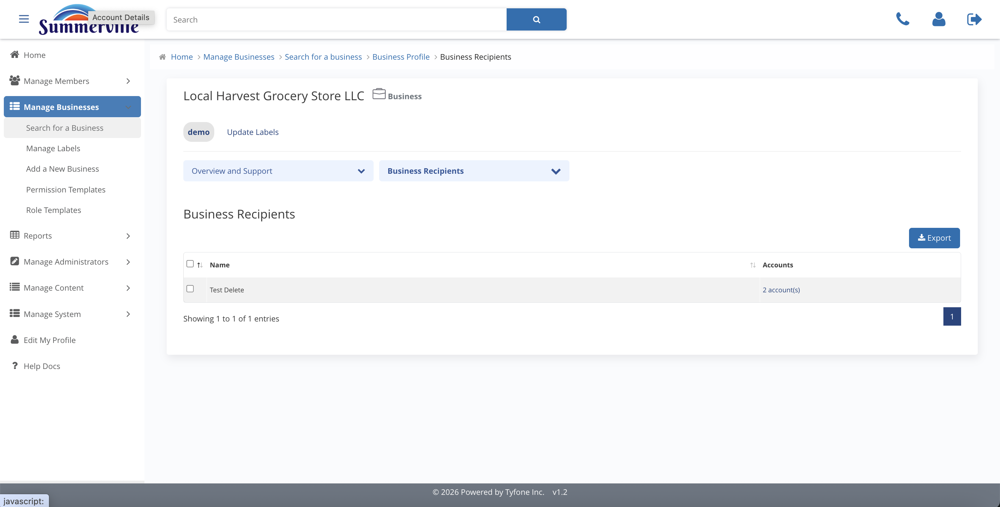
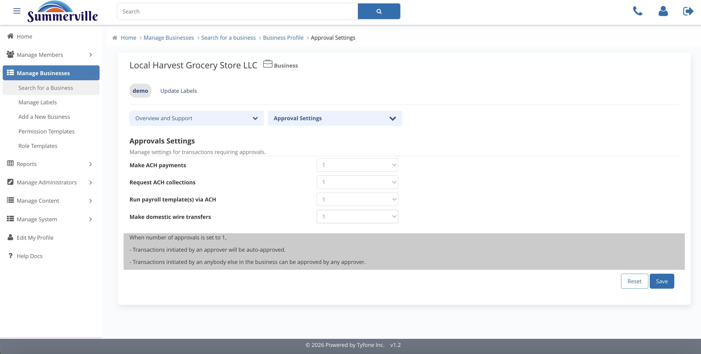

# Business Recipients & Approval Settings

_Summerville Admin Console › Manage Business › Business Recipients & Approval Settings_

## Manage Business: Business Recipients & Approval Settings

> Two independent sections of the business profile — Business Recipients holds the saved external payees, and Approval Settings holds the dual-control approver counts per payment type.

### Step-by-Step Workflow

#### Step 1: Business Recipients

The list of external bank contacts saved for ACH and wire payments, each tagged by recipient type. This is the business's saved payee register — pruning stale entries here is part of routine hygiene.

#### Step 2: Recipient Detail

Click any row to see the full record: name, bank, masked routing and account numbers, and recipient type. Use this view to confirm the bank details on file when a payment dispute mentions a specific payee.

#### Step 3: Approval Settings

Defines how many approvals each payment flow requires before release. Low-value ACH typically needs one; high-value ACH, wires, and ACH collections should require two or more — this is the dual-control configuration for business payments.

### Summary

Business Recipients is the saved payee list — it shows who the business can pay and the bank details on file. Approval Settings is the dual-control framework — it sets how many approvers must sign off on each payment type before release. The two sections are independent and edited separately.

### Key Use Cases

* Phishing attempt reported on a business account: review the recipient list for unfamiliar payees, remove stale entries, and raise the approval count for high-value ACH and wires in Approval Settings.
* Quarterly recipient review on a commercial business: open Recipient Detail on each row, confirm the bank details still match what's on file with the business.
