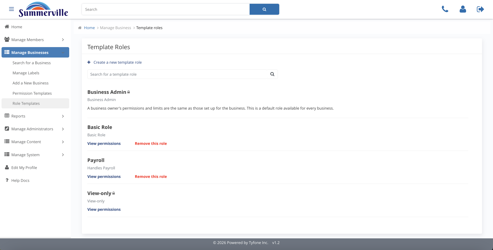
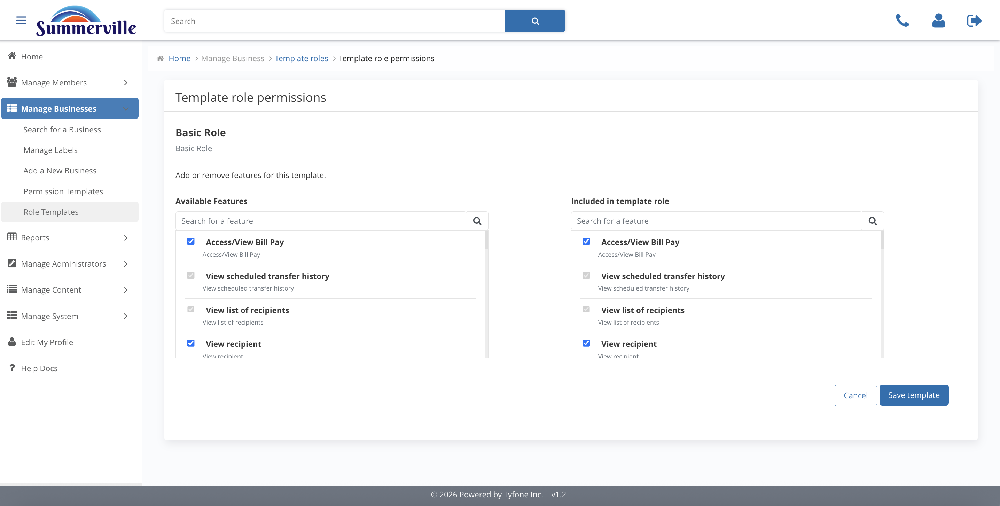

_Summerville Admin Console › Manage Business › Role Templates_

# Manage Business: Role Templates

> Central catalogue of pre-built roles every business can inherit.

## Step-by-Step Workflow

### Step 1: Template Roles

Pre-built roles: Business Admin, Basic Role, Payroll, View-only. Lock icons mark system defaults that can't be deleted.

### Step 2: Create New Template Role

Two-step form: Role Information (name + description), then feature set.

### Step 3: Template Role Permissions

Read-only list of features the role grants: Bill Pay, Scheduled Transfer History, Recipients, External Transfers.

### Step 4: Edit Template Role

Dual-pane Available / Included editor. Every downstream business that picks this role inherits the edit.

## Summary

Role-level counterpart to Permission Templates. Standard roles here seed every business's user-roles panel. Edit carefully — it's a policy change.

## Key Use Cases

- Standardise a Payroll role across all commercial clients: create Payroll template with matching permissions.
- Trim View-only to hide scheduled-transfer history: edit template, retrospective check on existing clients.
