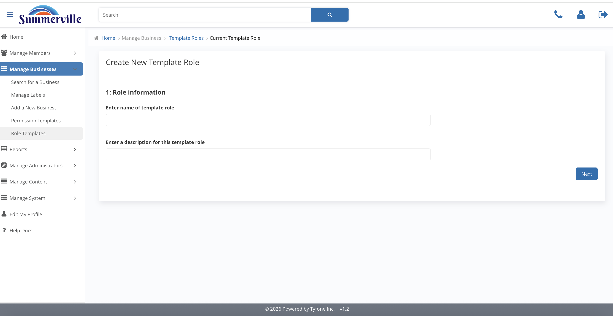
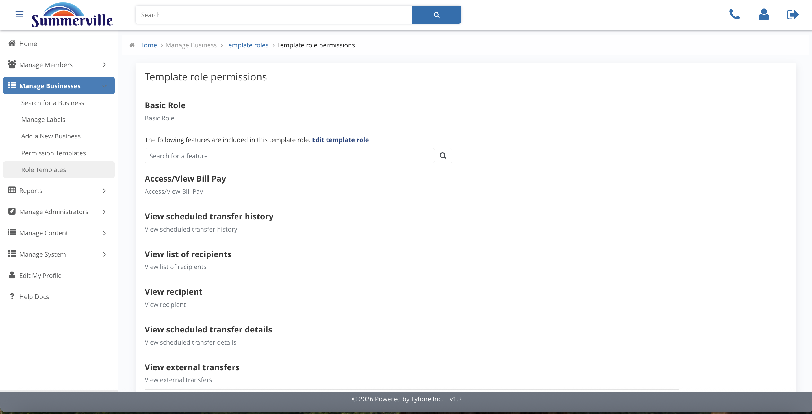

# Role Templates

_Summerville Admin Console › Manage Business › Role Templates_

## Manage Business: Role Templates

> The central catalogue of pre-built roles that every business can seed from — edit carefully, because changes are credit-union-wide.

### Step-by-Step Workflow

#### Step 1: Template Roles

The catalogue of pre-built roles available to all businesses: Business Admin, Basic Role, Payroll, View-only, and any others provisioned for Summerville. Lock icons on system defaults indicate they cannot be deleted — they can be edited, but with caution given their reach.

#### Step 2: Create New Template Role

A two-step form: first fill in Role Information (name and description), then define the feature set. Keep the role name plain and the description specific — this is what a business admin reads when assigning roles to employees who may not understand the technical distinctions between payment features.

#### Step 3: Template Role Permissions

Read-only view of the features this role grants: Bill Pay, Scheduled Transfer History, Recipients, External Transfers, and others. Review this before assigning a template to a new business to confirm the feature set matches the client's service agreement and risk profile.

#### Step 4: Edit Template Role

Dual-pane Available / Included editor. Every business that currently uses this template will have their users inherit the change at next login — this is a credit-union-wide policy change, not a single-business configuration, so it requires the same approval process as any other policy update.

### Summary

Role Templates are the credit-union-wide standard role definitions that every individual business seeds from. The catalogue ensures consistency across commercial relationships and reduces onboarding configuration time. Editing a template is a policy-level decision — the change propagates to every business using that template, so it must be approved and documented before being committed.

### Key Use Cases

* Standardize a Payroll role for all commercial clients: create a new Payroll template with ACH initiation included and wire release excluded, so every business can assign it without needing a custom configuration.
* View-only role needs to stop showing scheduled transfer history: edit the View-only template to move that feature to Available, then do a retrospective review of which existing clients are affected by the change.
