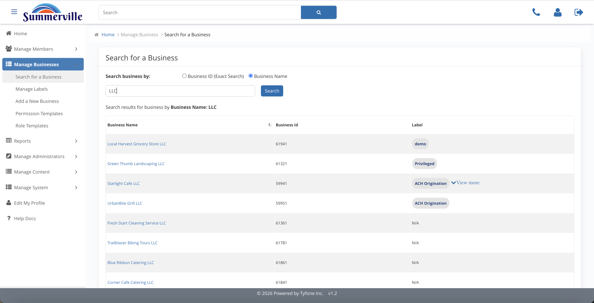
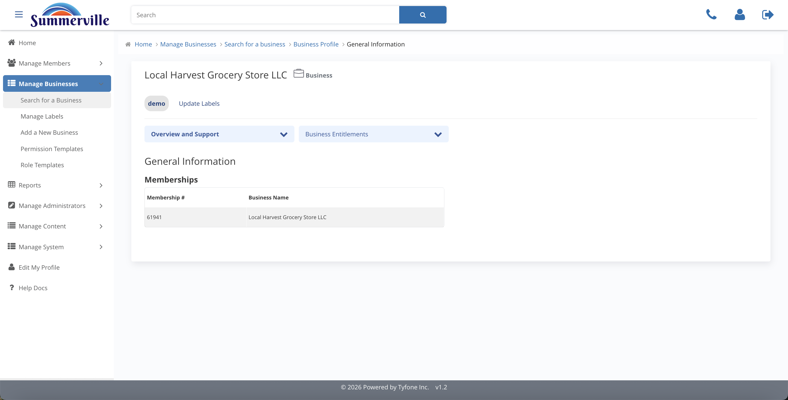

# Business Search & Profile

_Summerville Admin Console › Manage Business › Business Search & Profile_

## Manage Business: Business Search & Profile

> The entry point for every business-level admin action — find the business, then open its profile.

### Step-by-Step Workflow

#### Step 1: Search for a Business

Enter an exact Business ID for a direct hit, or a partial Business Name to pull a list of matches. Business ID is faster when you have it from a loan ticket, onboarding form, or case file.

#### Step 2: Search Results

Every matching business appears as a result card with its Labels visible — ACH Origination, Privileged, demo, and others. Use the labels to confirm the right entity before clicking in, especially when multiple businesses share similar names.

#### Step 3: Business Profile

The single pane of glass for everything related to this business. The left navigator gives you direct access to General Information, Business Permissions, Business Limits, User Roles, Recipients, Approval Settings, and Business Users — the full set of business sections in one place.

#### Step 4: General Information

Legal name, mailing address, and core-system IDs for this business. This view is read-only — staff cannot change anything about the business on this screen, it's purely for reference and identity confirmation before opening a different section to make changes.

### Summary

Business Search & Profile is the start of every Manage Business workflow. Search the business, open its profile, and use General Information to confirm identity. From the profile's left navigator, jump to the section that holds the change you need to make.

### Key Use Cases

* Loan-closing ticket includes the Business ID: search by ID, land directly on profile, confirm General Information.
* Walk-in with only a partial business name: search by name, use Labels and General Information to confirm the correct business before acting.
