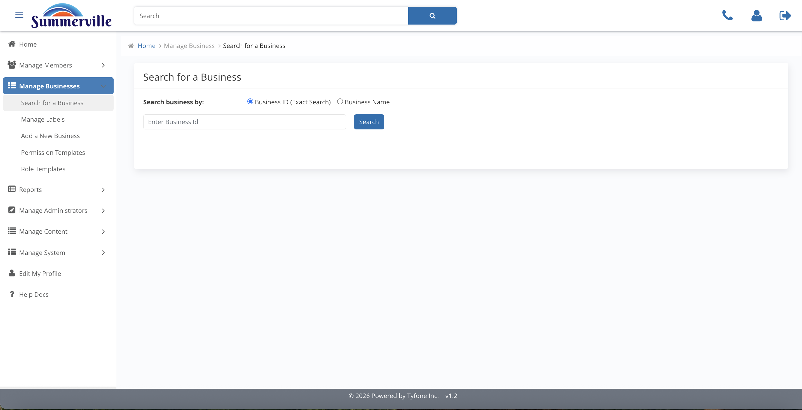
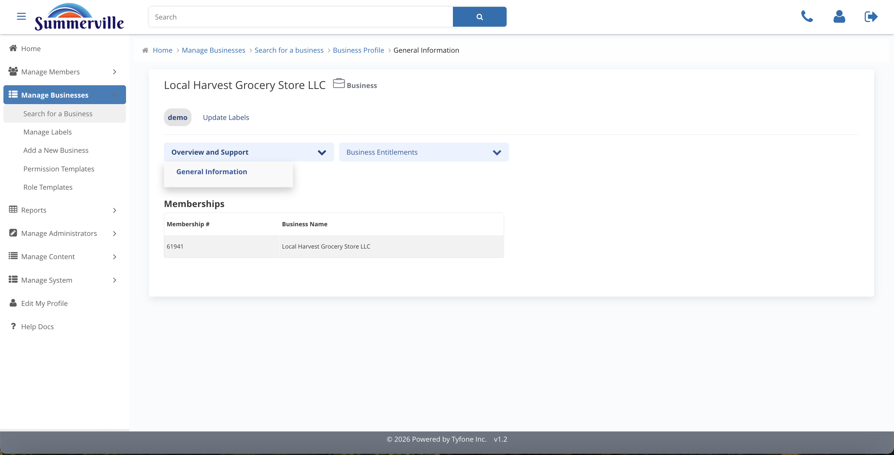
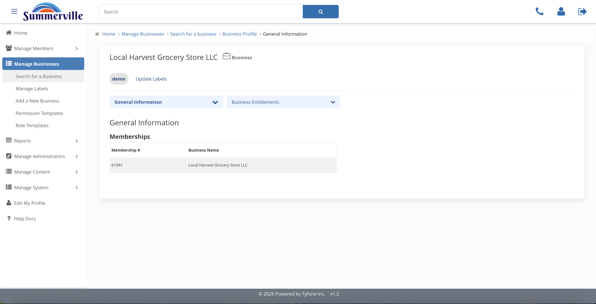

_Summerville Admin Console  ›  Manage Business  ›  Search & Profile_

# Manage Business — Search & Business Profile

> Find a commercial entity by Business ID or Name, land on the Business Profile, and review the General Information on file.

## Summary

Search & Business Profile is the entry point to Manage Business. Search for a Business accepts an exact Business ID or a partial Business Name, and clicking a result opens the Business Profile — the single pane of glass for the legal entity with a left-hand navigator for General Information, Business Permissions, Business Limits, User Roles, Recipients, Approval Settings, and Business Users.

The General Information panel is the first stop before any entitlement change: it links the digital profile to the book-of-record by surfacing legal name, mailing address, and core-system identifiers. A mismatch against the business's tax forms or signed banking agreement typically indicates the entity has recently changed legal structure and needs a core update before digital-banking changes can be trusted.

## Key Use Cases

A commercial loan officer sends a loan-closing ticket referencing a specific Business ID. The onboarding specialist opens Search for a Business, keys the ID, lands on the Business Profile, and begins the post-closing entitlement setup.

A walk-in servicing request gives only a partial business name. The operator runs a Name search, confirms the entity against the labels on the result card (ACH Origination, Privileged), and opens General Information to verify the legal name and address match the signed service agreement before touching any entitlement.

## End-to-End Workflow

### Prerequisites

- Business booked on the core banking system with a Business ID issued — the admin console matches businesses by that ID on an exact-search basis.
- At least one Permission Template and one Role Template active in the central catalogue, so a newly onboarded business inherits a production-ready default on day one.
- Signed treasury-services agreement, commercial pricing schedule, and approved credit memo lined up before any entitlement, limit, or role change is made.
- Documented dual-control policy agreed with Risk and Audit so the Approval Settings thresholds can be calibrated to policy rather than set by feel.

### Step-by-Step Flow

#### Step 1 — Open Search for a Business

Expand Manage Businesses in the left navigator and land on Search for a Business — the default sub-page that accepts either an exact Business ID or a partial Business Name. ID search is the fastest lookup when the operator already holds the loan ticket; Name search is the right choice when triaging a walk-in servicing request.

#### Step 2 — Review the search results

Run the search and the console returns every business that matches, with name, entity type, and the portfolio labels currently attached to each record. Labels such as ACH Origination, Privileged, and demo are visible on the result card so the operator can confirm the relationship's segmentation at a glance.

#### Step 3 — Land on the Business Profile

The Business Profile opens with the business name at the top and a left-hand navigator — General Information, Business Permissions, Business Limits, User Roles, Recipients, Approval Settings, and Business Users — each of which governs a different slice of the commercial relationship. Treat the profile as the single pane of glass for the client.

#### Step 4 — Use the Overview and Support dropdown

The Overview menu groups the read-only facts about the business, while Support exposes the servicing actions the bank team can run on the client's behalf. Opening this dropdown is the fastest way to confirm what the business currently sees in their own digital banking session before any entitlement change is made.

#### Step 5 — Review General Information

General Information displays the legal name, mailing address, and core-system identifiers that link this digital profile to the book of record. Confirm the data matches the business's tax forms and banking agreement before any downstream change, because a mismatch here typically means the business has recently changed legal structure.

