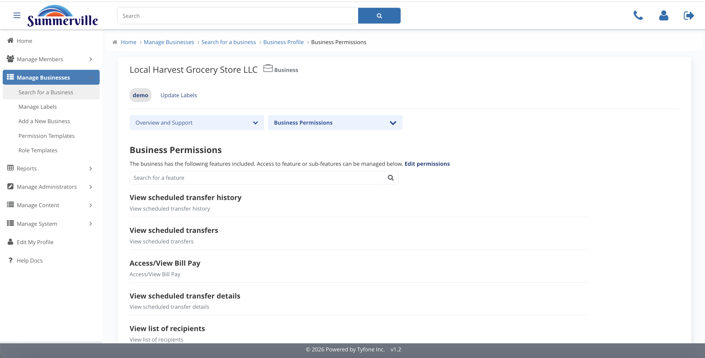
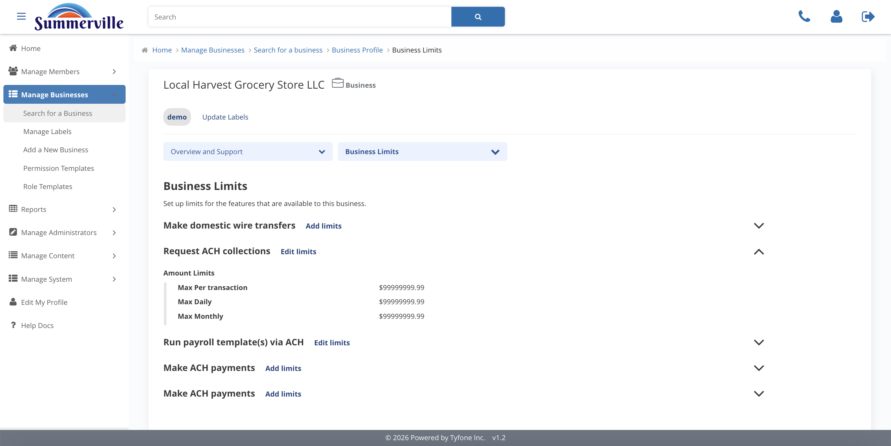
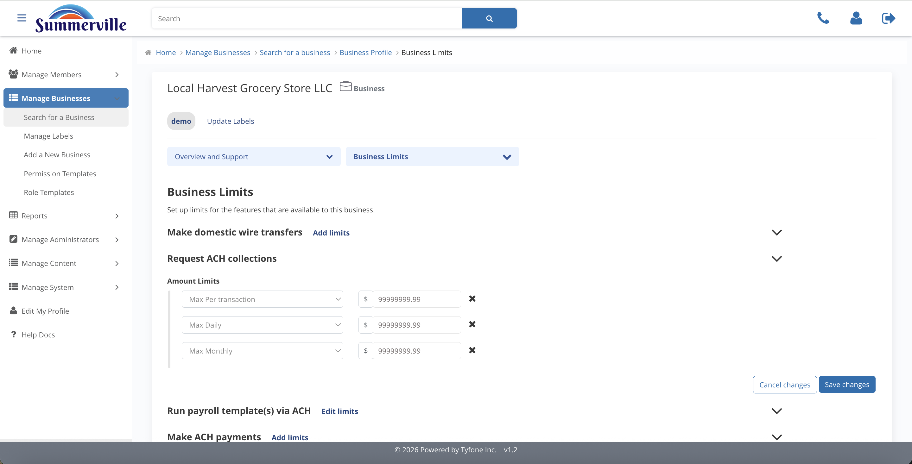

_Summerville Admin Console  ›  Manage Business  ›  Permissions & Limits_

# Manage Business — Permissions & Limits

> What the business can do (Permissions) and how much (Limits).

## Step-by-Step Workflow

### Step 1 — Business Permissions

The live feature catalogue for the business — ACH, wires, bill pay, scheduled transfers, recipients.

### Step 2 — Edit Business Permissions

Two panes: Available (left) and Included (right). Move features across to match the signed pricing schedule. Saves propagate on next user login.

### Step 3 — Business Limits

Entity-level ceiling. No user in the business can exceed it.

### Step 4 — Edit Business Limits

Three inputs per feature: Max Per Transaction, Max Daily, Max Monthly. Set against the credit memo and BSA/AML profile.

## Summary

Two linked pages: Permissions = what capabilities the business has, Limits = the dollar ceiling on each. Both are entity-level — they cap every user in the business.

## Key Use Cases

- Client grows into international suppliers → add Wires in Permissions, raise wire Max in Limits.
- ACH-only onboarding → Wires stay on Available side until dual-control is in place.
