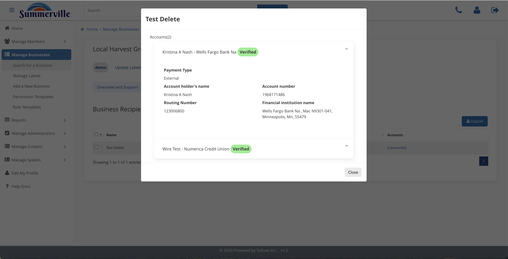

_Summerville Admin Console  ›  Manage Business  ›  Recipients & Approvals_

# Manage Business — Recipients & Approval Settings

> Curate the business's recipient master list, promote verified payees, and set the approval thresholds that enforce Summerville's dual-control policy.

## Summary

Recipients & Approval Settings is where Summerville operationalises two of the most important commercial-fraud controls. Business Recipients is the master list of external bank contacts the business has built up for ACH and wires, tagged by recipient type and verification status. Approval Settings defines how many human approvals each outbound flow needs before it leaves the credit union.

The two surfaces work together. A verified recipient on a low-approval path is the right default for a routine vendor payment; an un-verified recipient combined with a two- or three-approval threshold on high-value ACH, wires, and ACH collections is the right shape for any payee that has not been out-of-band confirmed. These are the first line of defence against business-email-compromise and check-kiting schemes.

## Key Use Cases

A business reports a phishing attempt targeting their AP queue. The administrator opens Business Recipients, removes stale and unverified entries, and raises the Approval Settings count for high-value ACH and wires to two approvals, which immediately funnels every high-risk outbound payment into a dual-control work queue.

During a quarterly KYC refresh the operator walks every recipient's detail drawer, compares the receiving bank and account against the supporting document the client provided, and promotes each verified payee — which keeps the verified recipient list clean and makes the low-approval path defensible.

## End-to-End Workflow

### Prerequisites

- Business booked on the core banking system with a Business ID issued — the admin console matches businesses by that ID on an exact-search basis.
- At least one Permission Template and one Role Template active in the central catalogue, so a newly onboarded business inherits a production-ready default on day one.
- Signed treasury-services agreement, commercial pricing schedule, and approved credit memo lined up before any entitlement, limit, or role change is made.
- Documented dual-control policy agreed with Risk and Audit so the Approval Settings thresholds can be calibrated to policy rather than set by feel.

### Step-by-Step Flow

#### Step 1 — Review Business Recipients

Recipients is the master list of payees the business has built up — external bank contacts for ACH and wires, tagged by recipient type and verification status. Review this list on every periodic KYC refresh, because an un-verified or inactive recipient is a disproportionate share of commercial fraud exposure.

#### Step 2 — Open a recipient detail

Clicking a recipient opens the detail modal — name, receiving bank, routing and account masking, recipient type (Individual or Business), and verification status. Use this view to confirm that the bank and account on file match the supporting document the client provided, and to mark the recipient Verified once the micro-deposit or out-of-band confirmation clears.

#### Step 3 — Configure Approval Settings

Approval Settings defines how many human approvals each outbound flow needs before it leaves the credit union — one for low-value ACH, two or three for high-value ACH, wires, and ACH collections. These thresholds are the operational expression of Summerville's dual-control policy and should be calibrated with Risk and Audit before changes go live.

