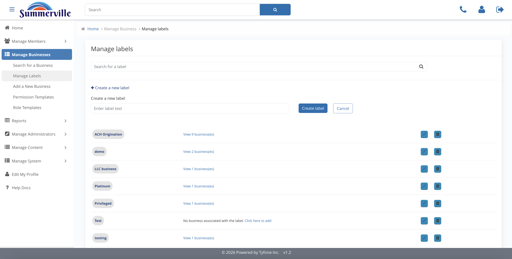
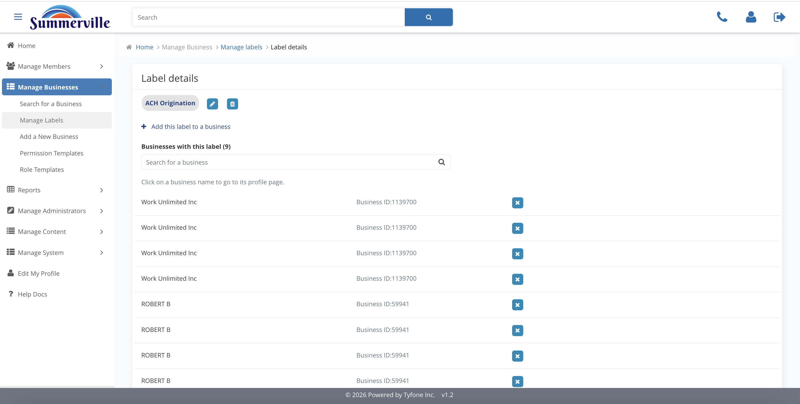
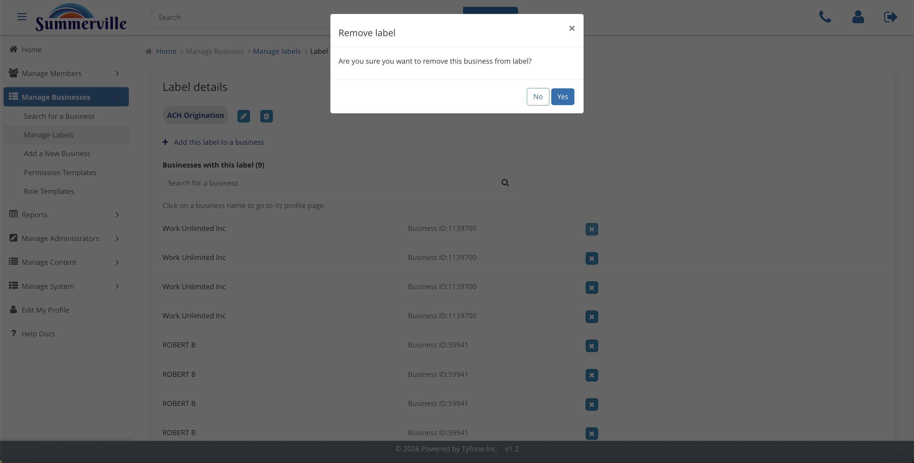

_Summerville Admin Console  ›  Manage Business  ›  Labels_

# Manage Business — Labels & Portfolio Segmentation

> Maintain the segmentation vocabulary that drives Treasury campaigns, risk-based monitoring, and pricing reviews across the commercial book.

## Summary

Labels & Portfolio Segmentation is where Summerville builds the segmentation vocabulary for its commercial book — ACH Origination, demo, LLC business, Platinum, Privileged, and so on. Manage Labels is the catalogue, each label's detail surfaces every business currently tagged, a Remove is deliberately gated behind a confirmation modal because of downstream campaign dependencies, and the Add Label modal on a Business Profile attaches one or more existing labels to the current entity.

A disciplined label catalogue is the backbone of Treasury marketing, risk-based monitoring, and pricing campaigns. Reports, outbound journeys, and audit extracts pivot on labels rather than on ad-hoc lookups, which is what lets a single operator run a California-only campaign or a Treasury-only advisory without building a new channel every time.

## Key Use Cases

The Treasury sales team wants to run a positive-pay campaign against every LLC that already originates ACH. The administrator opens the ACH Origination label detail, confirms the tagged businesses match the expected segment, and hands the list to the campaign team rather than rebuilding it from a core extract.

A relationship manager promotes a long-standing client to Privileged tier. The operator opens the Business Profile, uses the Add Label modal to attach Privileged, and the change is immediately picked up by downstream reports and journeys without a data-warehouse rebuild.

## End-to-End Workflow

### Prerequisites

- Business booked on the core banking system with a Business ID issued — the admin console matches businesses by that ID on an exact-search basis.
- At least one Permission Template and one Role Template active in the central catalogue, so a newly onboarded business inherits a production-ready default on day one.
- Signed treasury-services agreement, commercial pricing schedule, and approved credit memo lined up before any entitlement, limit, or role change is made.
- Documented dual-control policy agreed with Risk and Audit so the Approval Settings thresholds can be calibrated to policy rather than set by feel.

### Step-by-Step Flow

#### Step 1 — Maintain the Labels catalogue

Manage Labels is where Summerville builds the segmentation vocabulary for its commercial book — ACH Origination, demo, LLC business, Platinum, Privileged. A disciplined label catalogue is the backbone of Treasury marketing, risk-based monitoring, and pricing campaigns, so treat label creation with the same rigour as a CRM tag: owned, documented, and periodically pruned.

#### Step 2 — Drill into a label

Open a label such as ACH Origination and the console lists every business currently carrying that tag, each link-clickable back into its profile. This is the fastest way to run a campaign or a risk sweep across a segment: start from the label and fan out to the businesses, rather than the other way around.

#### Step 3 — Remove a label with confirmation

Removing a label is deliberately gated behind a confirmation modal because it affects every business that carries the tag and every downstream campaign that pivots on that tag. Before confirming, make sure any active Treasury journey or risk report referencing this label has been migrated or paused — otherwise campaign reporting silently drops off for weeks.

#### Step 4 — Attach a label to a business

From within a business profile, the Add Label modal lets the operator attach one or more existing labels from the catalogue to the current entity. Use this when onboarding a new relationship — typically LLC business plus any product-level tags like ACH Origination — or when a relationship manager promotes a client to Privileged tier. The label change is immediately picked up by downstream reports and journeys.

