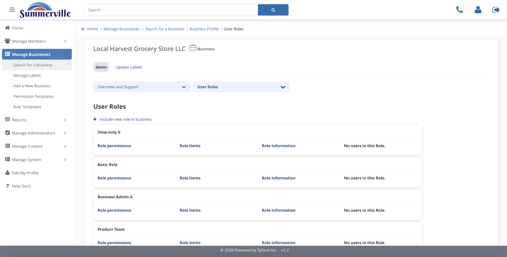
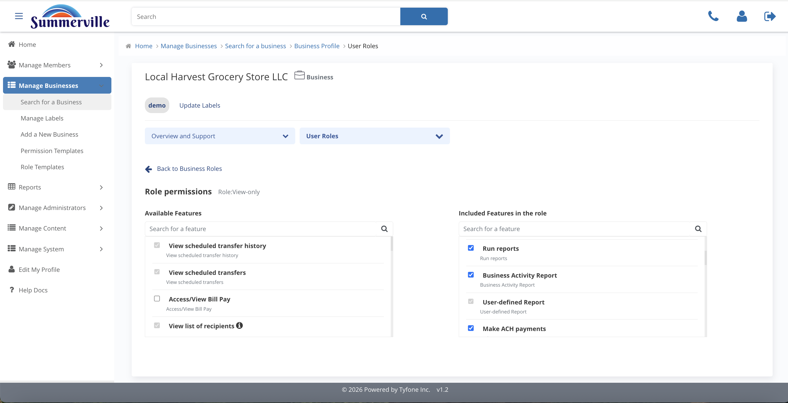
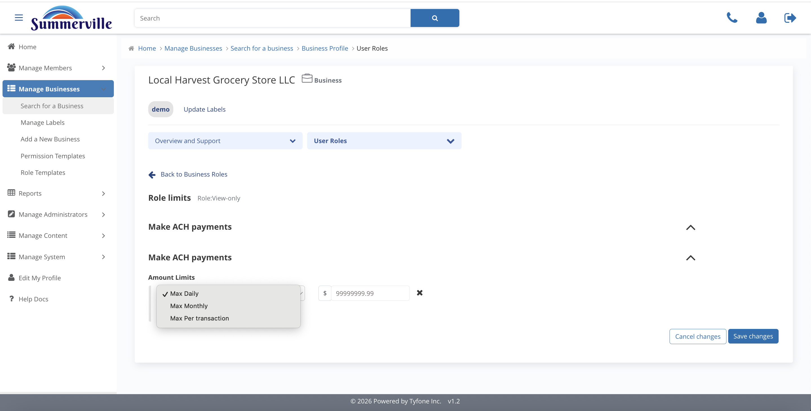
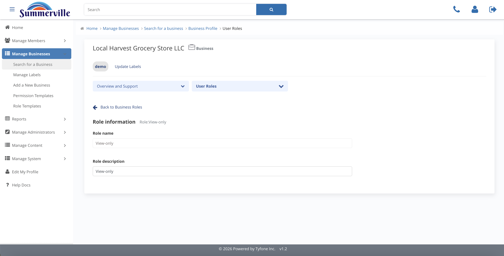

# Business User Roles

_Summerville Admin Console › Manage Business › Business User Roles_

## Manage Business: Business User Roles

> The role layer for the business — each role groups a set of permissions and dollar limits, and every business user is assigned a role.

### Step-by-Step Workflow

#### Step 1: User Roles

All roles configured on this business appear as cards: View-only, Basic Role, Business Admin, and any custom roles created for this business. This view shows how the business has structured its internal access before any change is made.

#### Step 2: Role Permissions

A two-pane Available / Included editor scoped to a single role. Move the capabilities the role needs into the Included pane — keep the role focused on what its function actually requires.

#### Step 3: Role Limits

Dollar caps per payment feature inside this role, bounded by the Business Limits. Role limits can be equal to or lower than business limits — they can never exceed them.

#### Step 4: Limit Frequency

Each dollar amount carries a frequency: Max Per Transaction, Max Daily, and Max Monthly. Stack all three to get layered control on a role.

#### Step 5: Role Information

The role name and a one-line description of what the role does — for example, "Payroll — handles payroll file builds" or "AP Clerk — vendor ACH only." Keep these clear so an admin assigning the role to an employee knows what it grants.

#### Step 6: Select Template Role(s)

Seed the new role from the central Role Templates catalogue — Payroll, Business Admin, Basic Role, or View-only — then trim and adjust from there. Starting from a template gives you the credit union's standard baseline before any business-specific change.

### Summary

Business User Roles is where the business decides what each role can do. Permissions sets the features the role can use. Limits and Limit Frequency set the dollar caps and how often they apply. Starting from a template gives the role a clean baseline before any business-specific change.

### Key Use Cases

* Payroll controller should build ACH files but not release wires: start from the Payroll template, confirm ACH initiation is Included, verify wire release is not.
* AP clerk restricted to vendor ACH only: start from Basic Role template, trim to ACH sub-features only, set per-transaction, daily, and monthly caps.
