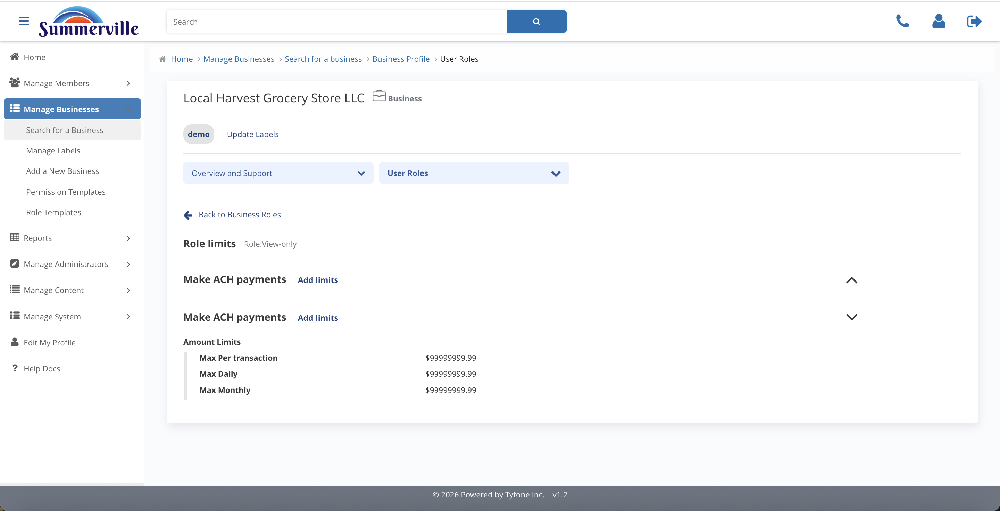
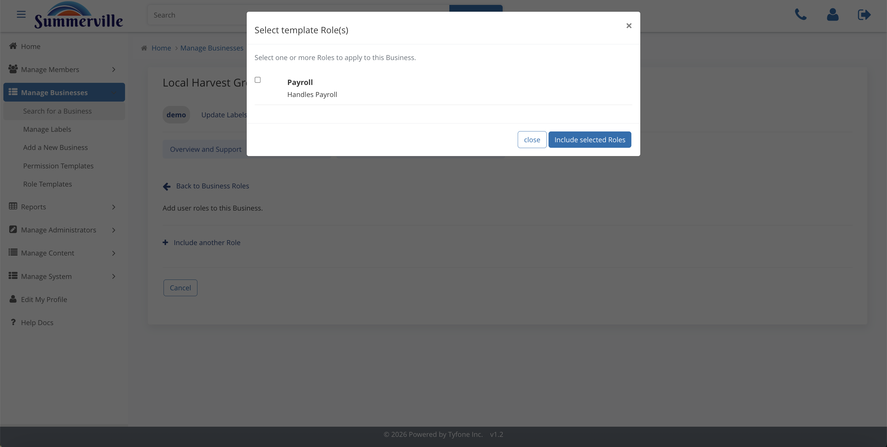

_Summerville Admin Console › Manage Business › User Roles_

# Manage Business: User Roles

> Per-role permissions, dollar caps, and frequency: the segregation-of-duties lever.

## Step-by-Step Workflow

### Step 1: User Roles

Every role on the business as a card: View-only, Basic Role, Business Admin, and client-specific roles.

### Step 2: Role Permissions

Dual-pane Available / Included scoped to one role. Enable only what the role needs.

### Step 3: Role Limits

Dollar cap per feature inside the role. Bounded by the entity-level Business Limits.

### Step 4: Limit Frequency

Each amount carries a frequency: Max Per Transaction, Max Daily, Max Monthly.

### Step 5: Role Information

Role name and one-line description. Read by audit six months later.

### Step 6: Select Template Role(s)

Seed from the central Role Templates catalogue: Payroll, Business Admin, Basic Role, View-only, then trim.

## Summary

Roles enforce segregation of duties. Permissions = what the role can do. Limits = the dollar and frequency caps. Seed from a template, then tailor.

## Key Use Cases

- Payroll controller builds files but can't release: Payroll template, ACH on, wire-release off.
- AP clerk, vendor ACH only: Basic Role template, trim to ACH sub-features, stack all three frequency caps.
