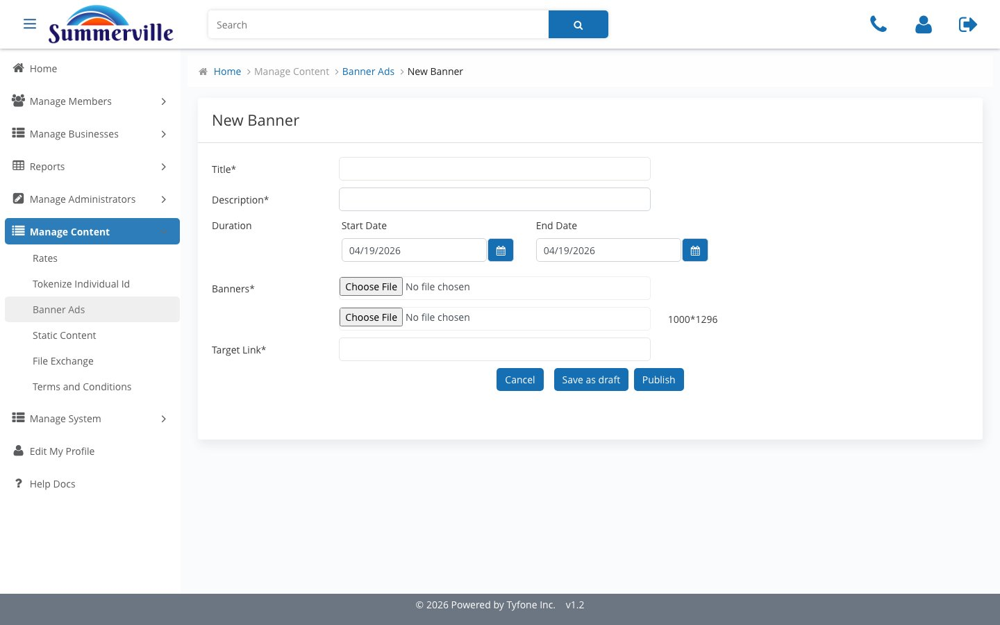

# Banner Ads

_Summerville Admin Console › Manage Content › Banner Ads_

## Manage Content: Banner Ads

> Publish time-boxed promotional banners to the member dashboard — the Duration window handles retirement automatically.

### Step-by-Step Workflow

#### Step 1: Banner Ads

The banner register showing all active and scheduled creatives. An empty "No Banners to display" state is expected on a fresh tenant or after all active banners have hit their End Date — it's not an error, it just means no campaigns are currently running.

#### Step 2: Add Banner Ads

The New Banner form collects Title, Description, Duration (Start / End dates), creative upload (1000x1296), and Target Link. The Duration window is what drives auto-retirement — once the End Date passes, the banner stops displaying without any manual intervention required.

### Summary

Banner Ads is how Marketing publishes promotional content directly to the member-facing dashboard without an engineering ticket. The Duration window is the key operational feature — it ensures banners retire on their scheduled End Date automatically, which eliminates the risk of stale promotional content continuing to run after a campaign closes.

### Key Use Cases

* 30-day Business Money Market promotion: set exact Start and End dates in Duration, upload the creative, the banner retires itself on End Date with no manual follow-up needed.
