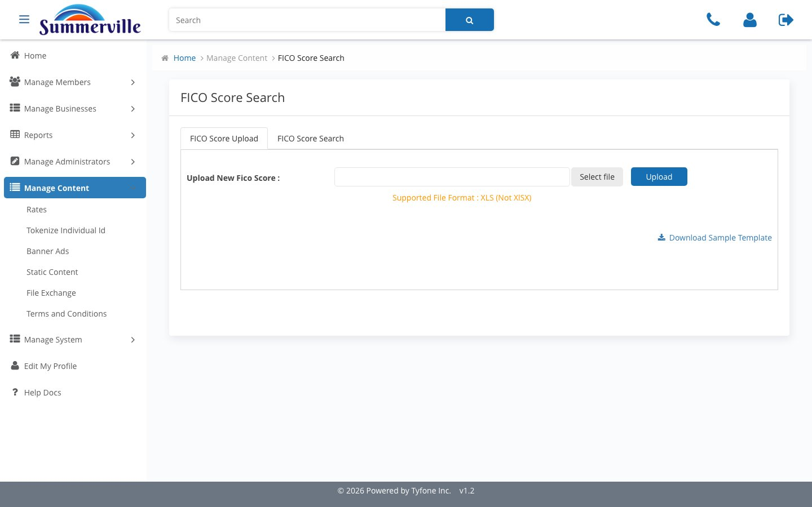

# FICO Groups

_Summerville Admin Console › Manage Content › FICO & Groups_

## Manage Content: FICO & Audience Groups

> Credit-score module content and the audience segmentation groups that power targeted campaigns across banners, notifications, and terms.

### Step-by-Step Workflow

#### Step 1: FICO

The copy, disclosures, and feature toggles for the credit-score module in the member experience. Marketing and Compliance jointly own this section — Marketing controls the enrolment messaging, while Compliance owns the vendor disclosure text and the opt-in language that governs how members consent to credit score access.

#### Step 2: Add Group

Content-segmentation groups that other Manage Content surfaces can target: Treasury-only, consumer-only, state-specific audiences, and others. Provision a group here first before trying to target it from Notifications, Banner Ads, or Terms — you can't reference a segment that doesn't exist in the catalogue.

### Summary

FICO manages the credit-score module content that sits at the intersection of Marketing and Compliance — both teams need visibility before changes go live. Add Group provisions the audience segments that give every other Manage Content surface its targeting capability. These two surfaces are niche but operationally important: FICO for credit-score feature launches, and Add Group as the prerequisite step for any targeted content campaign.

### Key Use Cases

* Credit union launches FICO enrolment on the commercial dashboard: stage vendor disclosure text and opt-in copy in FICO, get Compliance sign-off before publishing.
* California-only Treasury rate advisory: provision a California-specific segment in Add Group first, then target it from Notifications when drafting the advisory broadcast.
