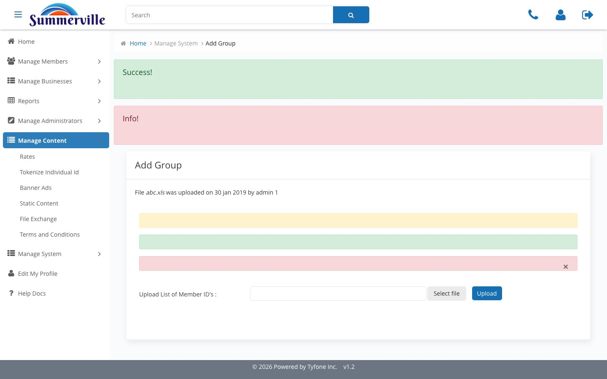

_Summerville Admin Console › Manage Content › FICO & Groups_

# Manage Content: FICO & Audience Groups

> Credit-score disclosure content and the segmentation groups that target campaigns.

## Step-by-Step Workflow

### Step 1: FICO

Copy, disclosures, and toggles for the credit-score module in the member experience. Jointly owned by Marketing and Compliance.

### Step 2: Add Group

Content-segmentation groups for banner, notification, and terms targeting: Treasury-only, consumer-only, state-specific audiences.

## Summary

Two niche Manage Content surfaces. FICO stages the credit-score module copy. Add Group provisions the audience segments other Manage Content surfaces target.

## Key Use Cases

- FICO enrolment launches on commercial dashboard: stage vendor disclosure and opt-in copy.
- California-only Treasury advisory: provision the segment in Add Group, target it from Notifications.
