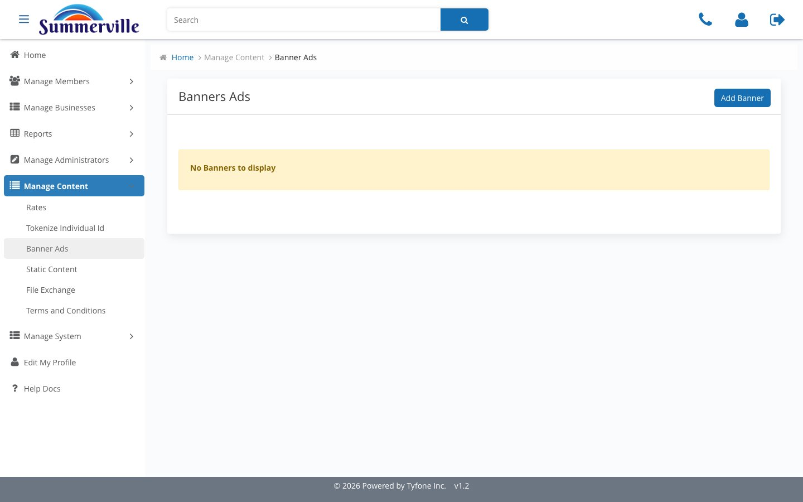

_Summerville Admin Console  ›  Manage Content  ›  Banner Ads_

# Manage Content — Banner Ads

> Publish commercial marketing banners on the member dashboard with duration windows that auto-retire the creative on its End Date.

## Summary

Banner Ads is the Manage Content surface where Marketing publishes dashboard banners and lets them retire themselves on a defined End Date. An empty No Banners to display register is the expected opening view for a fresh tenant and the correct view after every active banner has expired — the absence of ghost banners is a feature, not a bug.

Each banner captures Title, Description, Duration (Start Date / End Date), a 1000x1296 creative, and a Target Link. The Duration fields are what control auto-retirement, which is why they should be set deliberately against the campaign calendar rather than left open-ended.

## Key Use Cases

The commercial-deposit product team runs a 30-day promotion on Business Money Market rates. Marketing opens Banner Ads, sets Duration for the exact window, uploads the creative, and sets a Target Link into the product page — the banner retires itself on the End Date, eliminating the common failure mode of banners that run past their legal copy-expiry.

## End-to-End Workflow

### Prerequisites

- Manage Content role assigned to the operator via Manage Administrators (separate roles for Marketing, Compliance, and Content Operations where the bank has chosen to split duties).
- Approved marketing creative (1000x1296 banner image), approved legal document (PDF for Terms and Conditions), or approved broadcast copy for Notifications, reviewed and signed off outside the console.
- For scheduled content: a confirmed effective date or send timestamp in Pacific Standard Time, aligned with the regulatory, campaign, or operations calendar.
- For audience targeting: content-segmentation Groups already provisioned via Add Group so the operator can scope a banner or notification to the intended audience.

### Step-by-Step Flow

#### Step 1 — Open Banner Ads from the Manage Content navigator

From the left-hand navigator under Manage Content, click Banner Ads to land on the banner register. An empty No Banners to display state is the expected opening view for a fresh tenant and the correct view after every active banner has expired on its End Date — the absence of ghost banners is a feature, not a bug.

#### Step 2 — Open Add Banner and fill the New Banner form

Click Add Banner Ads to open the New Banner form. Capture Title and Description, set Duration by picking Start Date and End Date, upload the creative in the 1000x1296 format the platform expects, and fill the Target Link so the banner is clickable — the Duration fields are what control auto-retirement of the banner, so use them deliberately against your campaign calendar.

