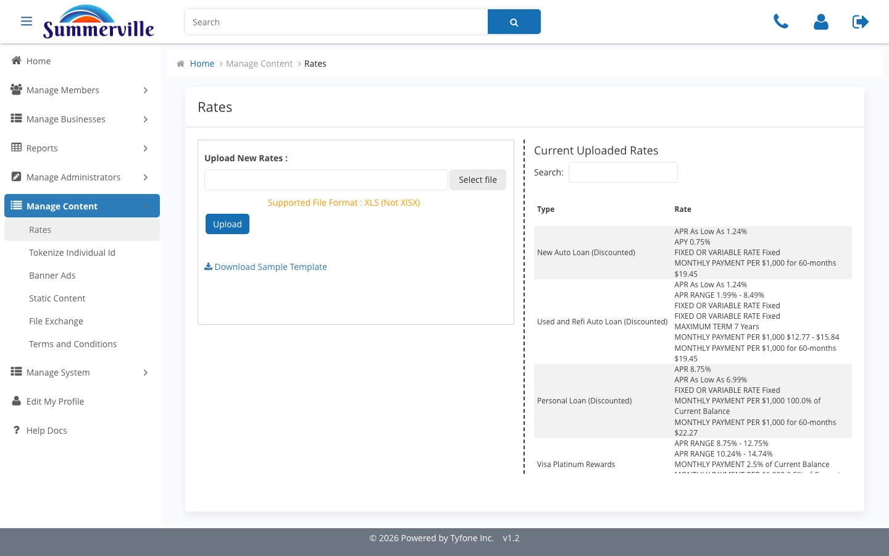
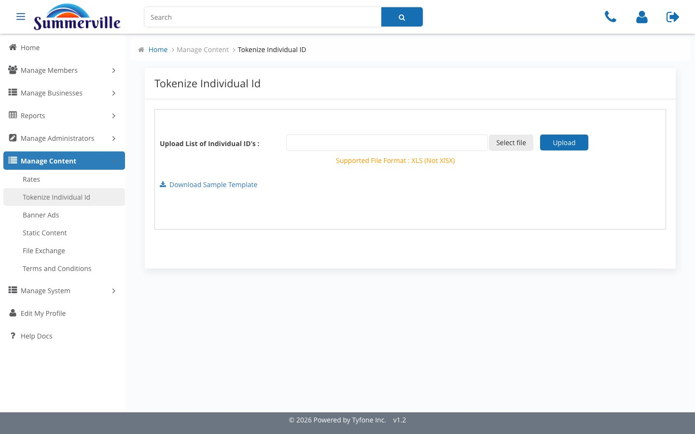
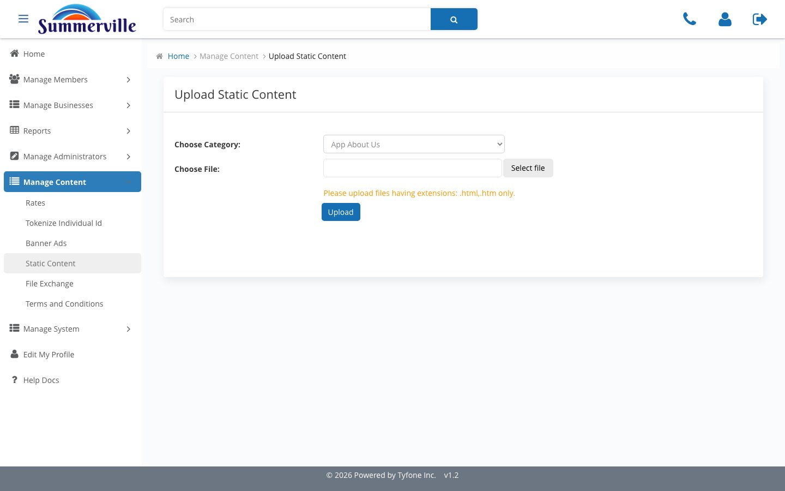
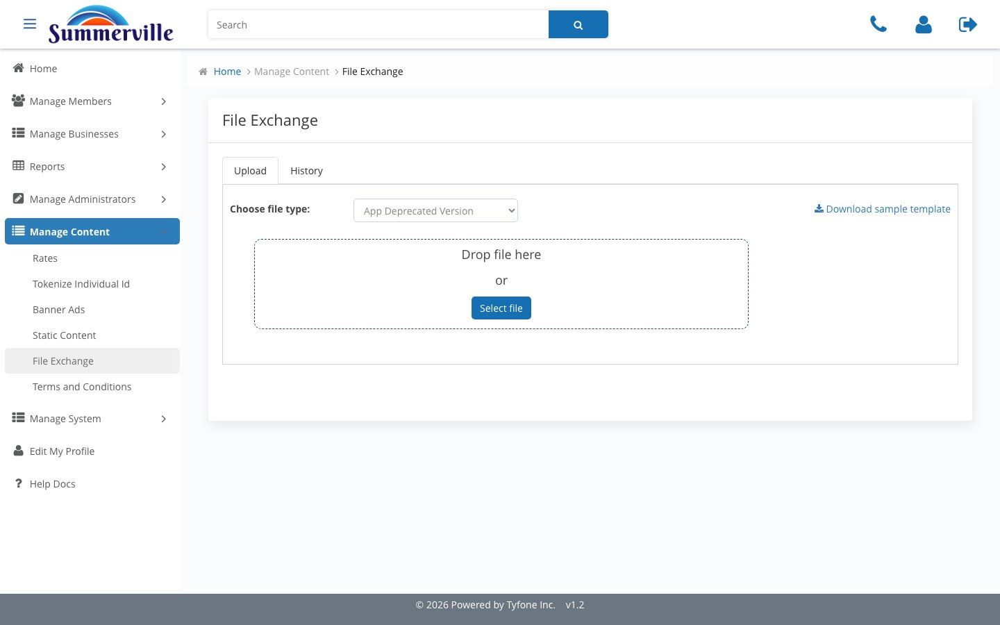

_Summerville Admin Console  ›  Manage Content  ›  Reference Data_

# Manage Content — Rates, Static Content & File Exchange

> Rate tiles, identifier tokenisation, fixed in-app copy, and secure bank-to-member file drops.

## Step-by-Step Workflow

### Step 1 — Rates

Deposit, loan, and mortgage tiles for the member-facing dashboard. Stage and publish to sync with Treasury's paper rate sheet.

### Step 2 — Tokenize Individual Id

How member identifiers are tokenised between console, channels, and fraud systems. Matters for PCI posture and analytics leakage.

### Step 3 — Static Content

Fixed in-app copy — help text, footer, enrolment prompts, explainers. Marketing and Compliance co-own it here instead of engineering tickets.

### Step 4 — File Exchange

Secure drop workspace for KYC packets, tax forms, and wire confirmations. Summerville keeps custody inside an authenticated session.

## Summary

Four surfaces for publishing reference content to members: rate tiles, identifier tokenisation, fixed copy, and secure file drops.

## Key Use Cases

- Treasury publishes new rate sheet → update Rates, dashboard re-renders on next load.
- Year-end trust forms to a client → File Exchange drop, audited and session-gated.
- Quarterly copy review → Static Content refresh, live next session.
