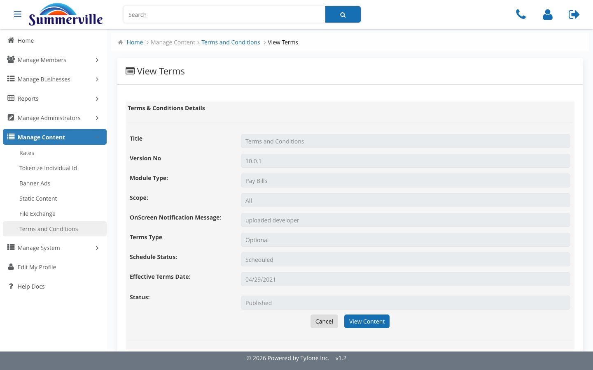

_Summerville Admin Console  ›  Manage Content  ›  Terms & Conditions_

# Manage Content — Terms & Conditions

> Stage, schedule, and publish legal disclosures — Forced or Optional, by module and channel.

## Step-by-Step Workflow

### Step 1 — Terms and Conditions

Versioned register of published agreements. Module / Status filters, Pacific Standard Time disclosure, Add new terms and conditions button.

### Step 2 — Add new terms and conditions

Title, Version No, Channels Type, Module Type, Scope, OnScreen Notification Message, Terms Type (Forced / Optional), file upload.

### Step 3 — Schedule — Later

Toggle Schedule to Later to expose Select Date. Platform flips the version at midnight PST on that date with no one on console.

### Step 4 — View Terms

Title, Version No, Module Type, Scope, OnScreen Notification, Terms Type, Schedule Status, Effective Date, Status, and View Content.

## Summary

Versioned legal content store. Compliance stages a disclosure, schedules it against its effective date, and the platform auto-flips at midnight PST. View Terms is the audit-ready record.

## Key Use Cases

- New Reg-E disclosure with a fixed effective date → upload, Forced, Schedule Later, platform flips automatically.
- Examiner asks which version was live on a date → open the Title, read the View Terms page.
