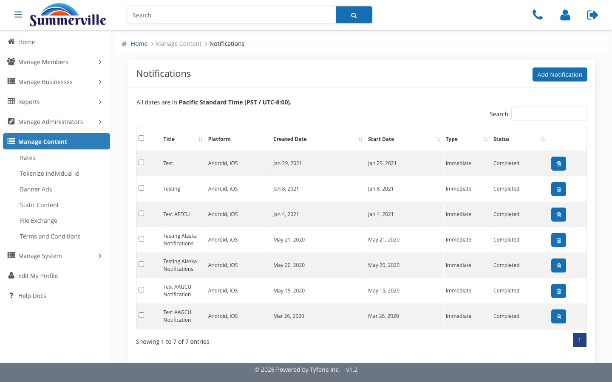
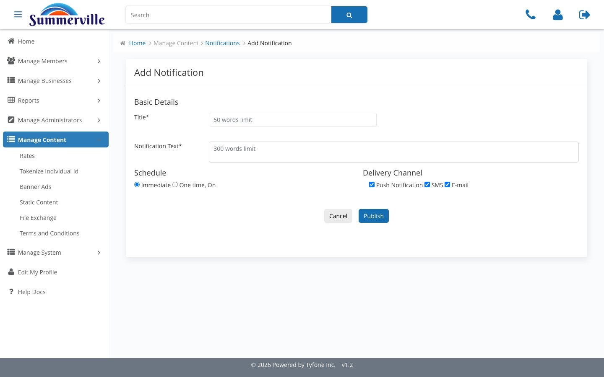
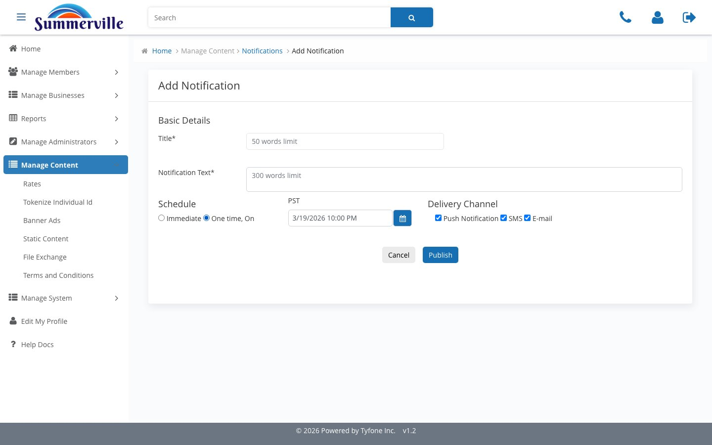
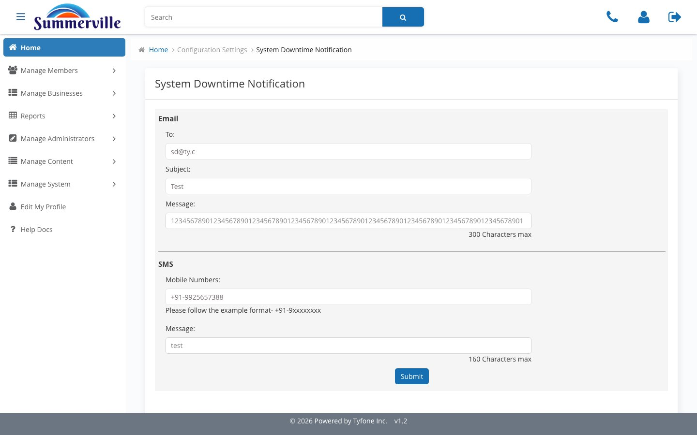

_Summerville Admin Console  ›  Manage Content  ›  Notifications_

# Manage Content — Notifications & System Downtime

> Push / SMS / Email broadcasts and the planned-outage advisory.

## Step-by-Step Workflow

### Step 1 — Notifications

Outbound broadcast register — Push, SMS, Email. Used by Marketing for reminders and by Treasury Ops for payment-window advisories.

### Step 2 — Add Notification

Title (50 words), Notification Text (300 words), Delivery Channels (Push / SMS / Email). Schedule Immediate for send-now.

### Step 3 — Schedule — One time, On

Toggle Schedule to One time, On to expose a PST timestamp picker. Right pattern for reminders or advisories that must land at a specific moment.

### Step 4 — System Downtime Notification

Planned-outage advisory — core conversions, wire-cut changes, mobile release windows. Separated from general Notifications for approvals and tone.

## Summary

Two broadcast surfaces. Notifications is the marketing and ops channel; System Downtime is the pre-outage advisory with its own approval path.

## Key Use Cases

- Enrolment reminder at 10 AM PST Monday → One time, On, Push + Email.
- Saturday core conversion → System Downtime draft, scheduled 72 hours ahead.
