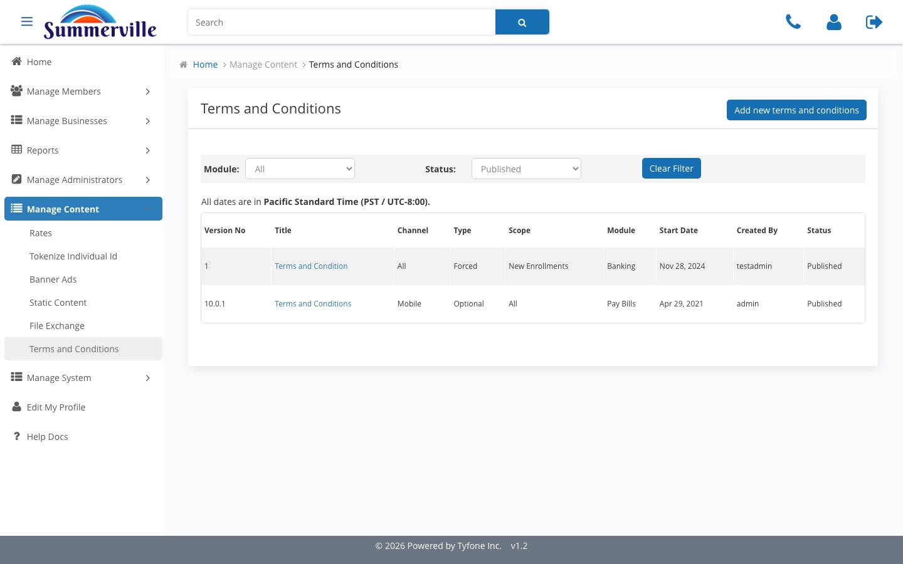
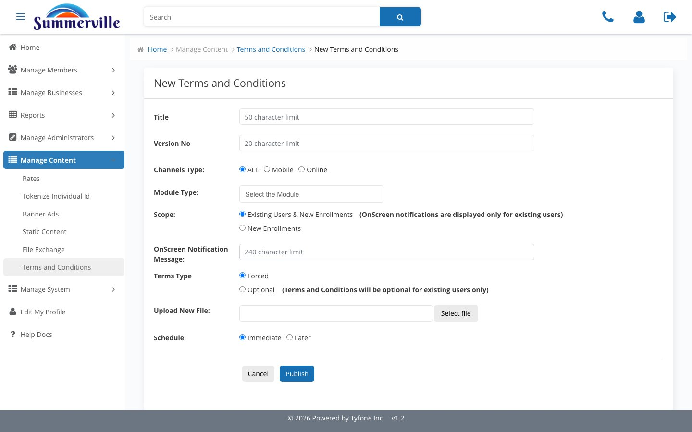
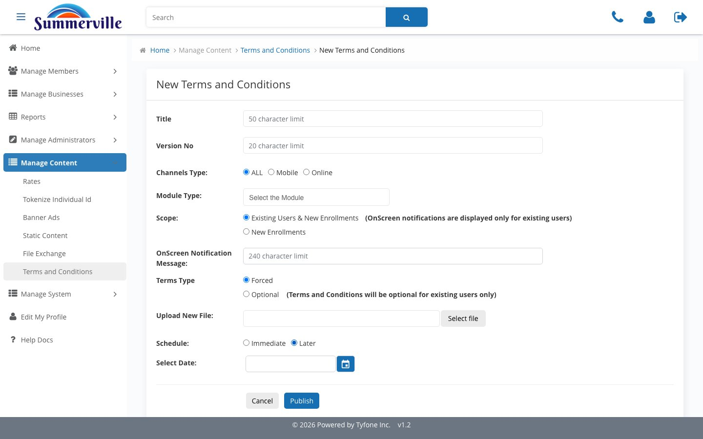

# Terms & Conditions

_Summerville Admin Console › Manage Content › Terms & Conditions_

## Manage Content: Terms & Conditions

> Stage, schedule, and publish legal disclosures — Forced or Optional, scoped by module and channel, with automatic midnight-PST activation.

### Step-by-Step Workflow

#### Step 1: Terms and Conditions

The versioned register of all published agreements. Module and Status filters let you narrow the view to active or pending disclosures. The Pacific Standard Time disclosure at the top of the page is a reminder that all scheduling operates in PST — relevant when coordinating with teams in other time zones.

#### Step 2: Add new terms and conditions

The form collects Title, Version No, Channels Type, Module Type, Scope, OnScreen Notification Message, Terms Type (Forced or Optional), and the file upload. Terms Type is the critical field — Forced requires affirmative member acceptance before the member can continue, while Optional displays without blocking access.

#### Step 3: Schedule - Later

Toggle Schedule to Later to expose the Select Date picker. The platform activates the new version at midnight PST on the selected date with no manual intervention — this is how Compliance meets a fixed regulatory effective date without needing anyone at the console at midnight.

#### Step 4: View Terms

The full detail record for a published agreement: Title, Version No, Module Type, Scope, OnScreen Notification, Terms Type, Schedule Status, Effective Date, Status, and View Content. This is the audit-ready record — open it when an examiner asks which version of a disclosure was live on a specific date.

### Summary

Terms and Conditions is a versioned legal content store with automated scheduling. Compliance stages a disclosure, sets the Terms Type, schedules the effective date, and the platform handles activation at midnight PST. View Terms provides the full audit record for any version, making it the go-to surface for regulatory examination and member dispute documentation.

### Key Use Cases

* New Reg-E disclosure with a fixed effective date: upload the document, set to Forced, Schedule Later with the regulatory date, platform activates automatically at midnight PST.
* Examiner asks which disclosure version was active on a specific date: open the relevant Title in the register, read the View Terms record for Effective Date and Status.
