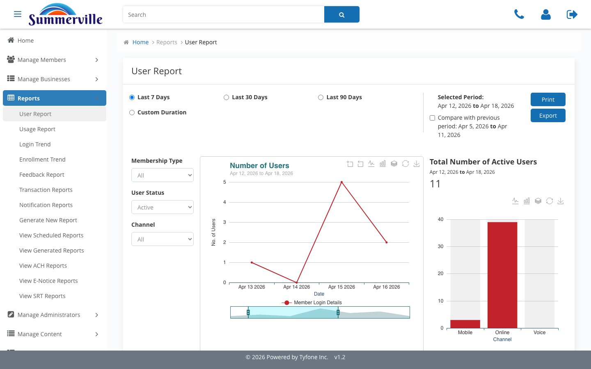
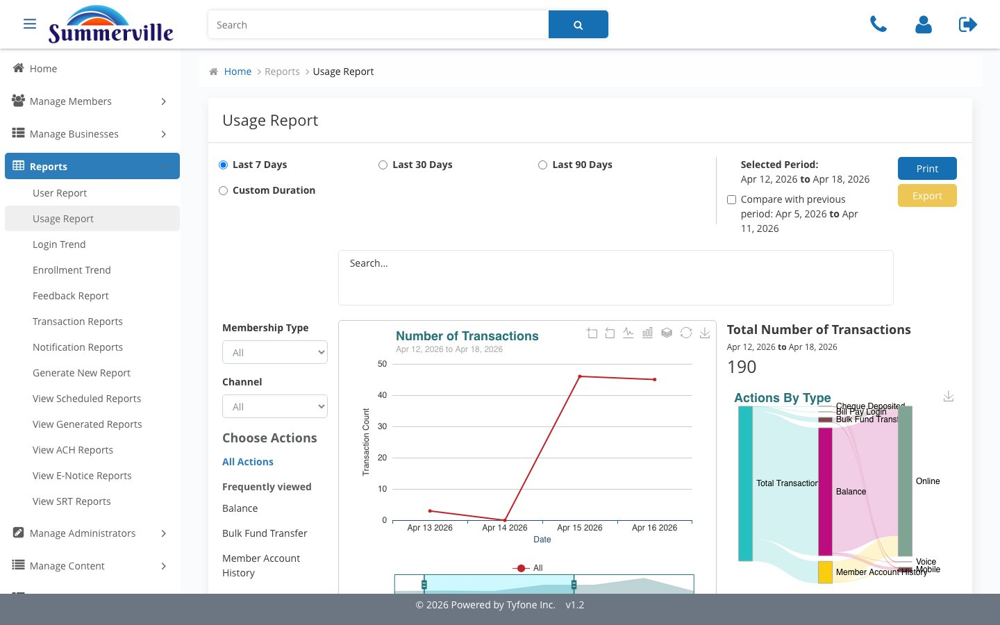
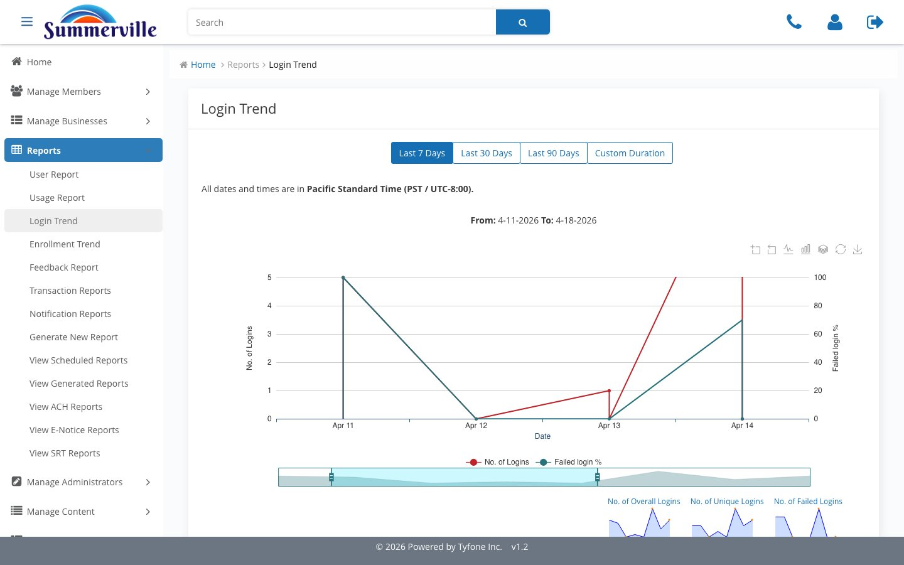
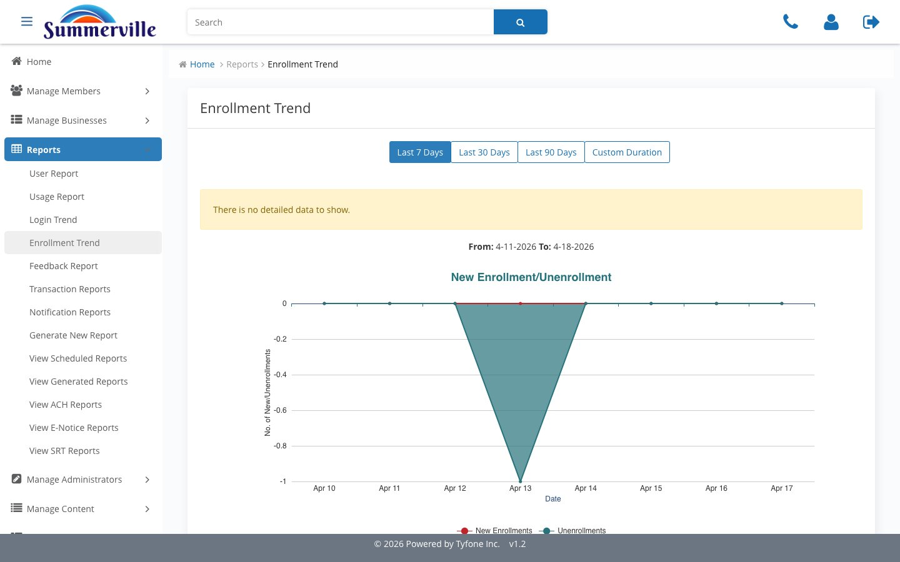
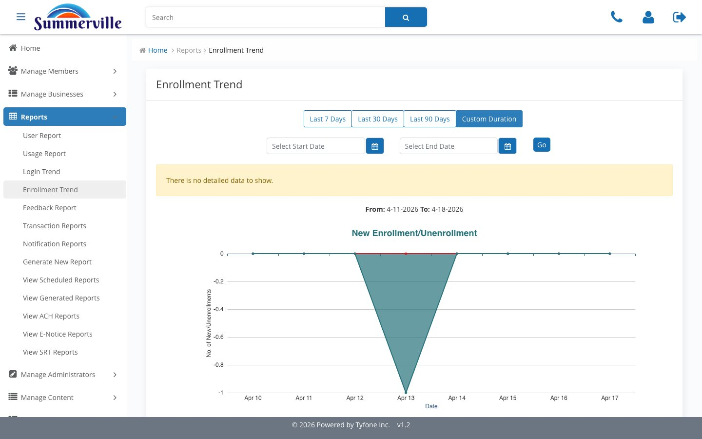
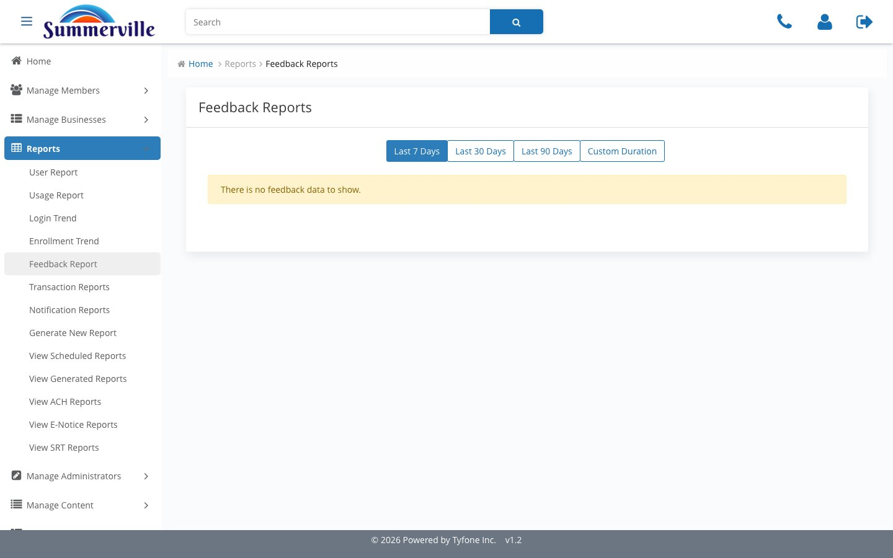

_Summerville Admin Console  ›  Reports  ›  Behavioural_

# Reports — Behavioural Reports

> Logins, active users, enrolments, usage, and member feedback across 7 / 30 / 90 / Custom windows.

## Step-by-Step Workflow

### Step 1 — User Report

Who's logging in. Membership Type, User Status, Channel filters; Number of Users chart and Active Users counter. Print / Export for evidence.

### Step 2 — Usage Report

Transaction volume and an Actions-by-Type Sankey broken out by feature and channel (Online, Mobile, Voice).

### Step 3 — Login Trend

Logins vs failed-login percentage. Labelled Pacific Standard Time — matters when an incident timeline crosses a day boundary.

### Step 4 — Enrollment Trend

New enrolments and unenrolments. Yellow "No detailed data to show" banner appears on quiet days — low-enrolment days shouldn't be glossed over.

### Step 5 — Custom Duration

Four tabs — Last 7 Days, 30, 90, Custom. Custom exposes Select Start Date, Select End Date, Go. Same picker across every report.

### Step 6 — Feedback Report

In-app satisfaction rollups by window. Paired with Login Trend is the cheapest attrition early-warning Summerville has.

## Summary

Six behavioural surfaces sharing one duration chassis. Answer: who logged in, what they did, whether they signed up, and what they said about it.

## Key Use Cases

- Monday ops stand-up → Login Trend + User Report + Enrollment Trend on Last 7 Days.
- Quarterly board pack → each report on Last 90 Days, print, consolidate.
- Weekly VOC review → Feedback Report + Login Trend as an attrition early-warning.
