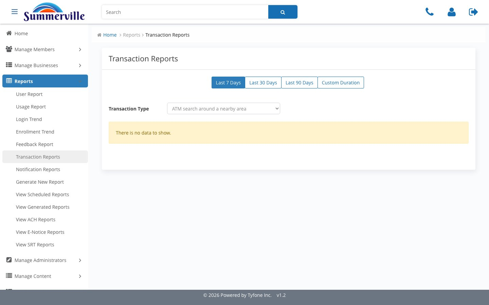
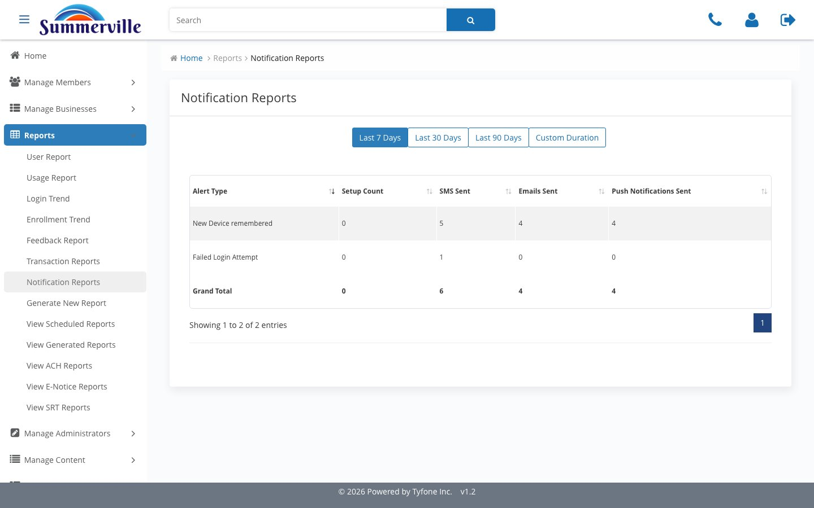

_Summerville Admin Console  ›  Reports  ›  Transaction & Notification_

# Reports — Transaction & Notification

> What members are actually doing, and whether their alerts are being delivered.

## Step-by-Step Workflow

### Step 1 — Transaction Reports

Transaction Type dropdown from lightweight interactions (ATM search) to every money-movement flow. Scoped to the chosen duration.

### Step 2 — Notification Reports

Each Alert Type vs setups, SMS, email, and push counts. Sortable columns and a Grand Total row.

## Summary

Transaction Reports shows what's being done; Notification Reports shows what's being delivered. Together they close "what did members do" and "did they get alerted" questions without SQL.

## Key Use Cases

- Pricing review → walk Transaction Type dropdown on Last 90 Days, hand back the distribution.
- "I didn't get notified" ticket → Notification Reports, scope to window, read the Failed Login Attempt row.
