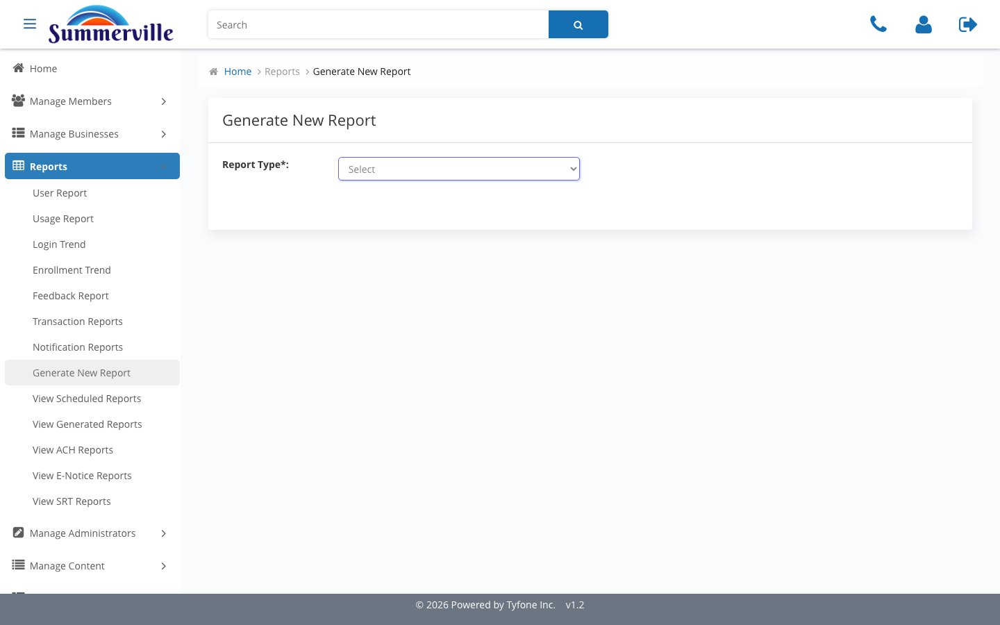
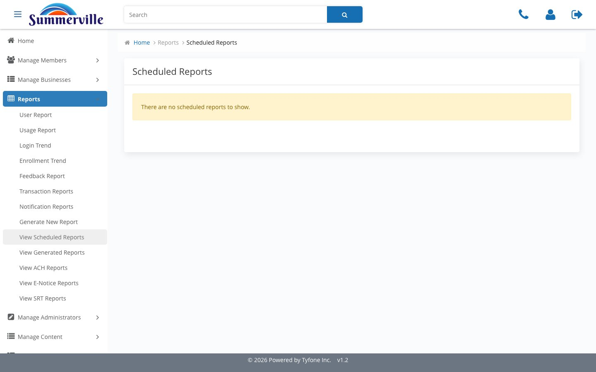
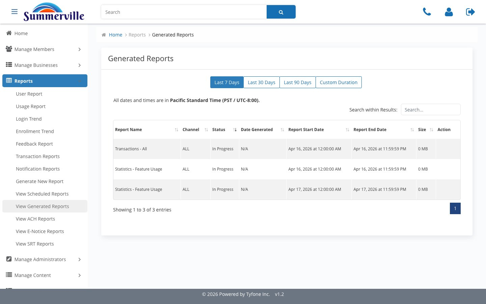
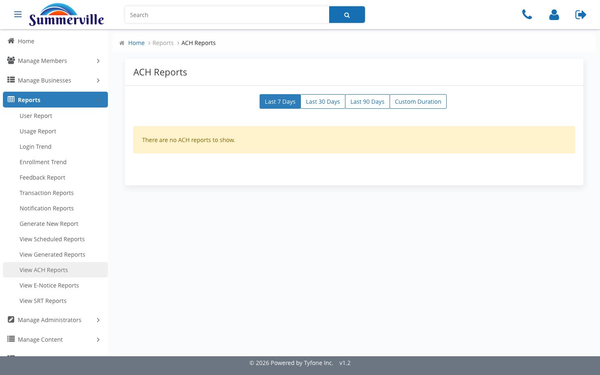
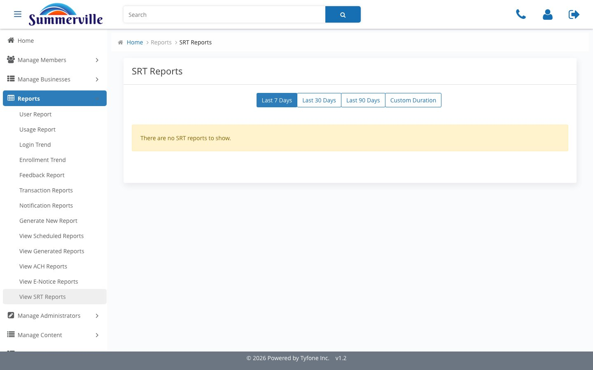

_Summerville Admin Console  ›  Reports  ›  Generation & History_

# Reports — Generation & History (ACH, E-Notice, SRT)

> Point-in-time extract jobs and the historical ACH, E-Notice, and SRT archives.

## Step-by-Step Workflow

### Step 1 — Generate New Report

Report Type dropdown — Transactions-All, Statistics-Feature-Usage, audit variants. Asynchronous: run shows up on Scheduled, then Generated.

### Step 2 — View Scheduled Reports

Recurring and queued extract jobs. Empty state renders No scheduled reports to show. First page to check when a downstream file is missing.

### Step 3 — View Generated Reports

Historical record — Report Name, Channel, Status, Date Generated, Start / End, Size, Action. Sortable, filterable, four-tab duration.

### Step 4 — View ACH Reports

Every ACH origination batch the channel produced. Empty windows render No ACH reports — absence on a business day is itself the signal.

### Step 5 — View E-Notice Reports

Electronic notices — statements, NSF, Reg-E / Reg-DD via digital channel. Pair with Notification Reports for delivery diagnostics.

### Step 6 — View SRT Reports

Service Request Tickets raised through digital channel. Operational analogue of the CRM case list, near-real time.

## Summary

Generation stands up extract jobs; Scheduled queues them; Generated is the history. ACH / E-Notice / SRT are three specialised archives, same duration chassis.

## Key Use Cases

- Examiner asks for Transactions-All over three weeks → View Generated, sort Date Generated, filter Report Name, export.
- "ACH file didn't originate" ticket → View ACH Reports, scope window, look for the absence.
- Monthly Statistics-Feature-Usage → Generate New Report, watch Scheduled, pick up from Generated when done.
