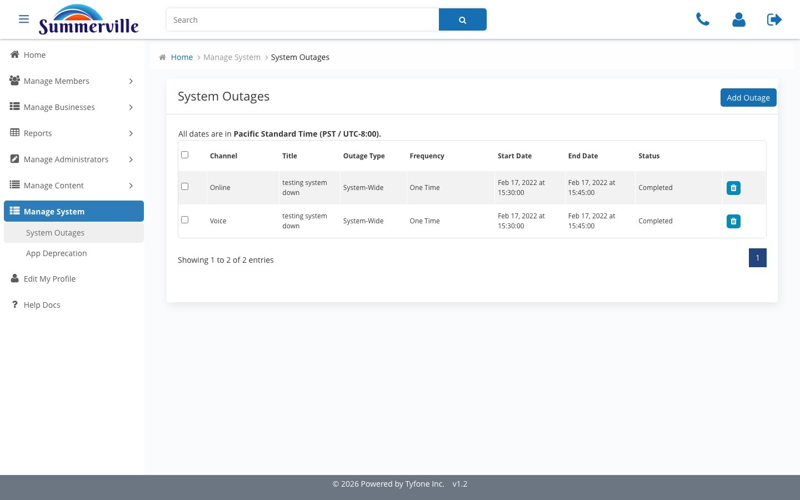
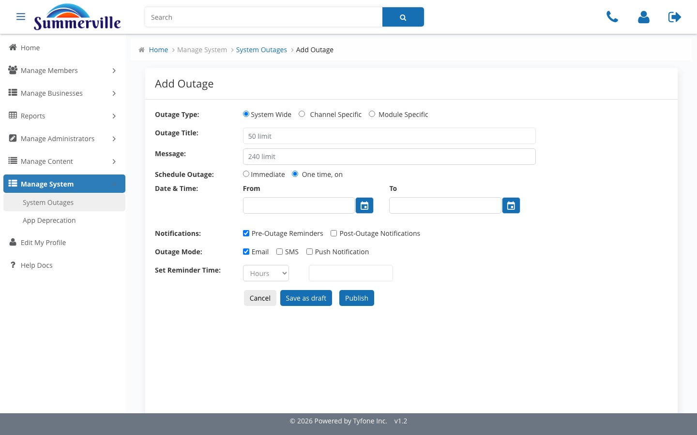
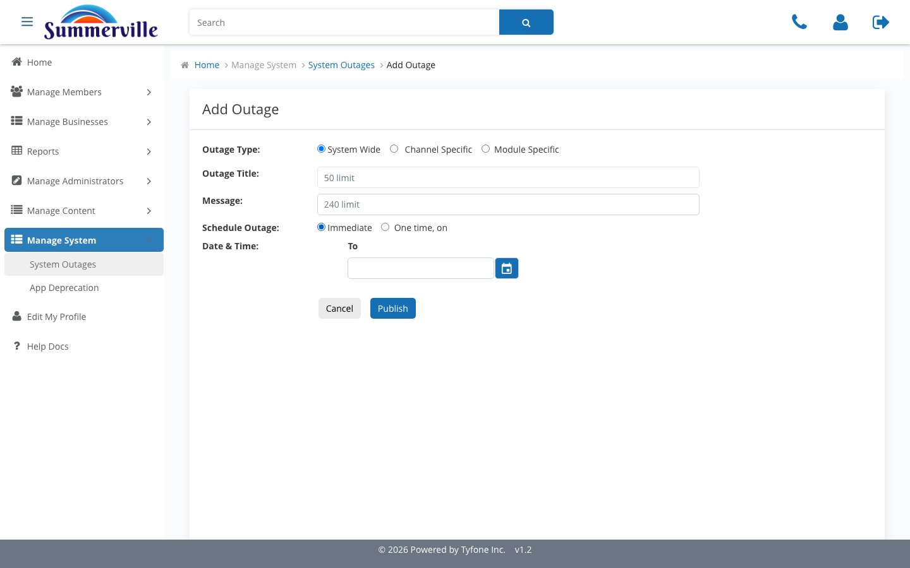
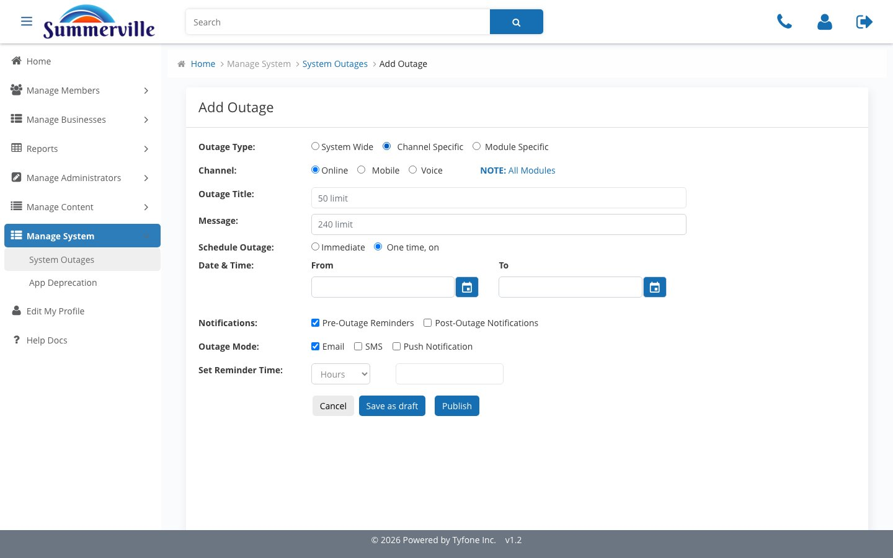
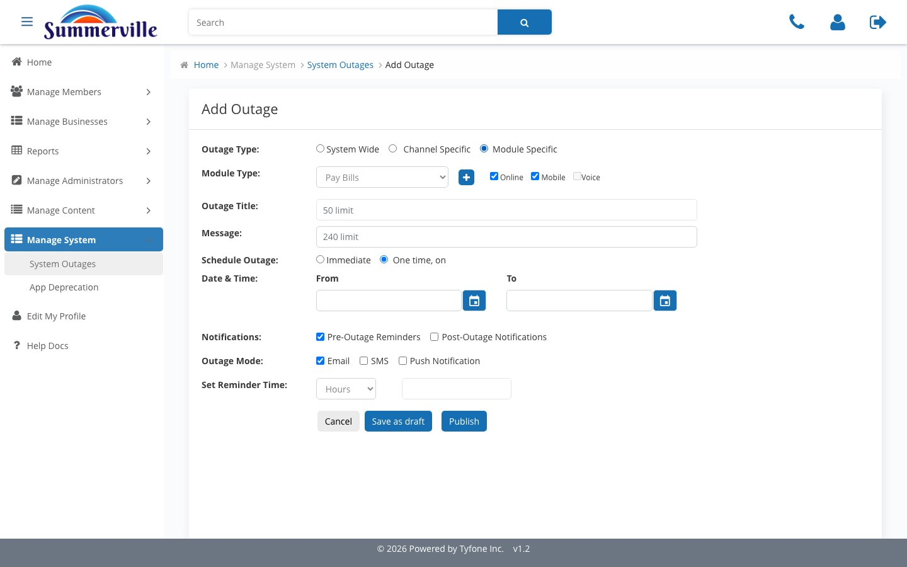
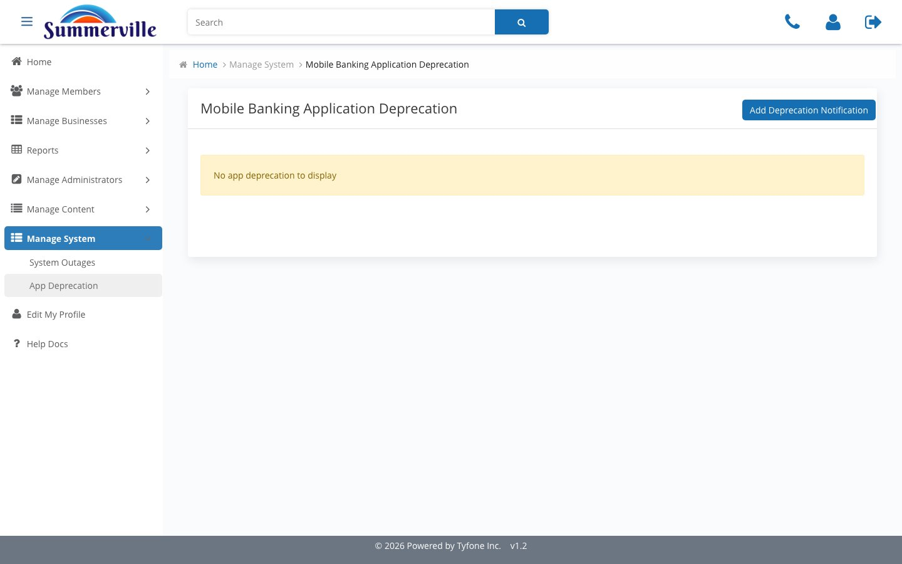
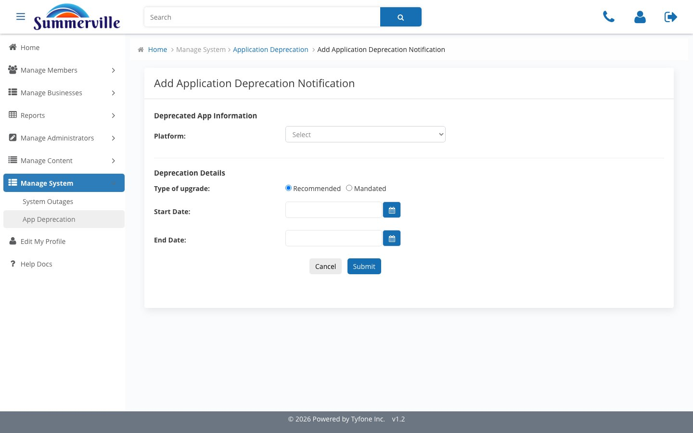
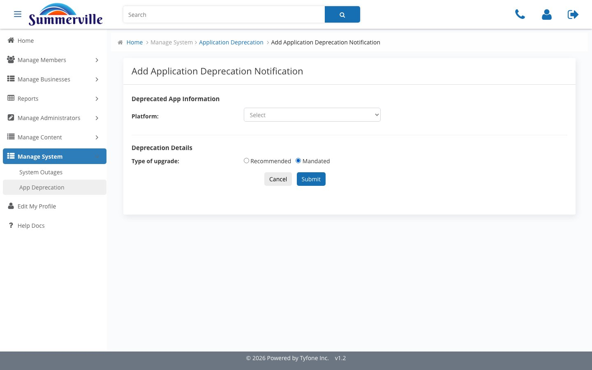

_Summerville Admin Console  ›  Manage System_

# Manage System

> Platform outages and mobile-app deprecation — operations-facing platform state.

## Step-by-Step Workflow

### Step 1 — System Outages

Register of outage events. Channel, Title, Outage Type, Frequency, Start / End, Status. All dates Pacific Standard Time.

### Step 2 — Add Outage

Default = System Wide, One time, on, Pre-Outage Reminders on, Email delivery. Conservative baseline — narrow explicitly.

### Step 3 — Schedule Outage — Immediate

Toggle to Immediate. Date & Time collapses to a single To field — incident-response shape.

### Step 4 — Outage Type — Channel Specific

Channel radio: Online / Mobile / Voice, with a NOTE: All Modules marker. Right scope for an IVR cutover or mobile SDK rollout.

### Step 5 — Outage Type — Module Specific

Module Type dropdown (Pay Bills, Wire, ACH…), plus icon to add siblings, Online / Mobile / Voice checkboxes. Narrowest blast radius.

### Step 6 — App Deprecation

Mobile Banking Application Deprecation register. Empty No app deprecation to display state is expected. Add Deprecation Notification is the entry point.

### Step 7 — Add Deprecation Notification — Recommended

Platform + Type of upgrade = Recommended. Start Date and End Date pickers appear — soft-nudge path for routine patches.

### Step 8 — Add Deprecation Notification — Mandated

Toggle Mandated. Dates disappear — hard cut-off on publish. Only when Risk or InfoSec can no longer trust the old build.

## Summary

Two surfaces: System Outages for planned and live-incident outages, App Deprecation for mobile-build lifecycle. Each outage is a first-class record that drives in-channel banners and gates member actions.

## Key Use Cases

- Saturday wire-cutoff change → Module Specific, Wire, pre- and post-notifications across Email + Push.
- IVR cutover → Channel Specific, Voice, 30 minutes. Online and Mobile stay live.
- Live incident → Immediate, System Wide, publish — banner fires before the next page refresh.
- TLS issue on old mobile build → App Deprecation, Mandated, blocks old builds on publish.
