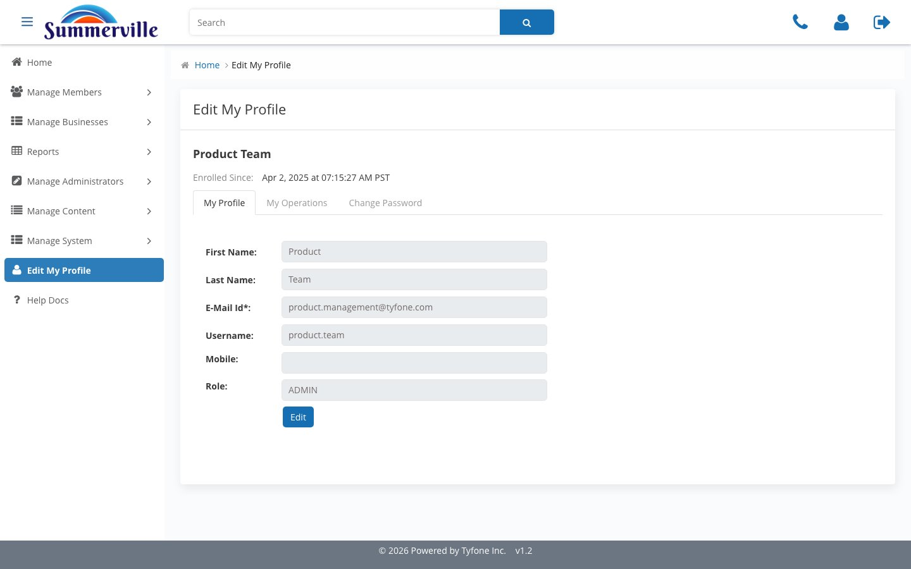
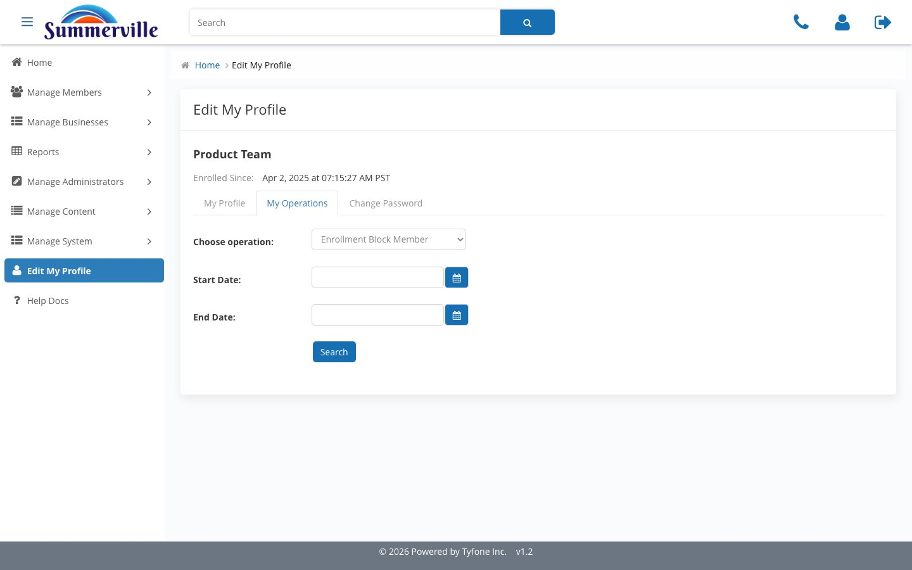
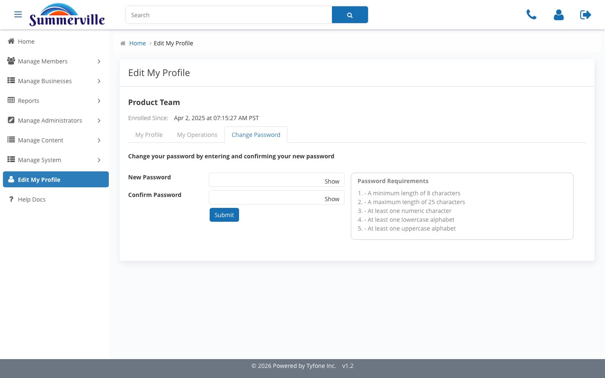

_Summerville Admin Console › Edit My Profile & Help Docs_

# Edit My Profile & Help Docs

> Your admin identity, personal activity log, password management, and the in-console help link — all in one place.

## Step-by-Step Workflow

### Step 1: My Profile

Displays your First Name, Last Name, E-Mail Id, Username, Mobile, Role, and Enrolled Since date. Mobile is the only field you can update yourself — Email and Role are locked to prevent self-escalation of access, which is an intentional segregation-of-duties control.

### Step 2: My Operations

Select an operation type from the Choose operation dropdown, set Start Date and End Date, and click Search to retrieve your personal activity log for that window. This is your own slice of the Admin Activity audit trail — use it to generate the evidence you need for quarterly access review attestations.

### Step 3: Change Password

Enter New Password and Confirm Password, each with a Show toggle for visibility confirmation. The Password Requirements panel displays the active policy: 8 to 25 characters, at least one numeric, one lowercase, and one uppercase character. Meet the policy requirements before submitting to avoid a validation rejection.

### Step 4: Help Docs

A direct link-out to Product and Content documentation maintained outside the console. It's deliberately a link-out rather than embedded content — the value is having the reference accessible from the same screen you're working in without needing to open a separate browser tab or search for the documentation site.

## Summary

My Profile has three functional tabs: your identity record, your personal audit log, and password management. Help Docs routes to the credit union's published product documentation. Together these surfaces give every admin what they need for day-one setup, ongoing access review attestations, and policy-compliant password rotations — all without leaving the console.

## Key Use Cases

- First day on the console: My Profile, verify your identity record is correct, update Mobile to your current number.
- Quarterly access review attestation is due: My Operations, set Start and End dates for the review period, export your activity log as the evidence for sign-off.
- 90-day password rotation required by policy: Change Password, meet the requirements displayed in the panel, submit.
- Question about a feature mid-task: Help Docs link-out, find the answer in the product documentation without losing your place in the console.
